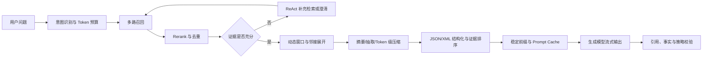
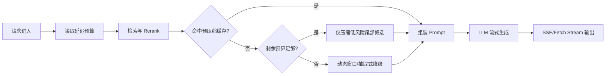

很多 RAG 系统的第一版都有同一种架构：检索器返回 Top-K Chunk，按相关度从高到低拼接，最后连同用户问题一起塞进大模型。只要没有超过模型的上下文窗口，团队就认为链路是安全的。

真实情况恰好相反。**能放进去，不等于模型能稳定用到；检索到了，也不等于应该原样发送。**

上下文优化（Context Optimization）不是简单地“缩短 Prompt”，而是在生成前，对候选证据进行选择、压缩、重排、结构化和动态补充，使有限的上下文预算承载尽可能高的有效信息密度。它连接了 RAG 的召回与生成，是决定成本、延迟和准确率能否同时上线的最后一道闸门。

本文默认文档解析、切分、召回和 Rerank 已经具备基本质量。相关前置工程可以分别参考：

- [《RAG 文档解析工程》](/posts/rag-document-parsing-guide/)；
- [《RAG 文档切分工程》](/posts/rag-document-chunking-strategies/)；
- [《RAG 知识召回优化实践》](/posts/rag-retrieval-optimization-practice/)；
- [《向量数据库索引选型指南》](/posts/vector-database-index-selection-guide/)。

## 一、为什么长上下文仍然解决不了 RAG

假设检索器返回 20 个 Chunk，每个 800 Token，加上系统指令、历史对话和输出预留，一次请求很容易超过 20K Token。即使所选模型支持 128K 甚至更长上下文，系统仍然会遭遇四类问题。

### 1.1 注意力不是均匀分配的

长上下文模型对不同位置的信息利用能力并不一致。[Lost in the Middle](https://arxiv.org/abs/2307.03172) 的实验观察到：关键信息位于开头或结尾时表现往往较好，位于长上下文中间时可能明显下降。后续模型能力会进步，但这条工程原则仍然成立：**窗口长度是容量上限，不是有效注意力的服务等级承诺。**

RAG 还会进一步放大问题：相邻 Chunk 重复、多个版本互相冲突、同义但无答案的内容大量混入。正确证据即使已经召回，也可能被噪声淹没。

### 1.2 Token 成本不是线性问题那么简单

输入 Token 直接产生费用；更长的 Prefill（预填充，即模型处理输入上下文）也会消耗更多计算。进入 Agent 或 ReAct 循环后，相同上下文可能在多轮工具调用中被反复发送，成本由“一次长 Prompt”变成“长 Prompt × 推理轮数”。

因此要同时观察：

```text
单请求成本 = 未缓存输入 Token 成本
           + 缓存写入/读取成本
           + 输出 Token 成本
           + 压缩或自省模型成本

单答案成本 = 单请求成本 × 平均模型调用次数 + 检索与计算资源成本
```

压缩后少了 40% Token，并不必然意味着总成本下降 40%。如果为了压缩增加一次昂贵模型调用，或 ReAct 平均多检索两轮，最终账单可能反而更高。

### 1.3 API 限流会同时卡住 Token 与并发

企业使用的模型服务通常不只有 RPM（Requests Per Minute，每分钟请求数）限制，还有 TPM（Tokens Per Minute，每分钟 Token 数）或类似吞吐配额。一个超长请求不仅自己慢，还会占用更多 Token 配额，造成排队、429 重试和尾延迟扩散。

容量规划不能只看 QPS：

```text
安全吞吐 ≈ min(
  RPM 上限 / 每次用户请求的平均模型调用数,
  TPM 上限 / 单次调用的 P95 输入输出 Token
)
```

### 1.4 TTFT 被输入处理时间吞噬

TTFT（Time To First Token，首字响应延迟）包含网关排队、检索、Rerank、上下文处理、网络传输和模型 Prefill。流式输出只能降低用户等待完整答案的体感，**不能让模型在 Prompt 尚未组装完成时提前生成第一个 Token**。

所以，上下文优化要回答的不是“如何尽可能缩短文本”，而是三个问题：

1. 哪些信息必须保留，哪些可以压缩或删除？
2. 保留下来的证据应该按什么结构与顺序进入模型？
3. 优化本身引入的延迟，是否小于它节省的 Prefill 延迟？

## 二、先建立统一的上下文预算器

没有预算器的优化只是零散技巧。生产系统应在 Context Builder（上下文组装器）中显式分配 Token，而不是拼接后发现超长再粗暴截断。

```text
B_total   = 模型上下文上限
B_output  = 最大输出预留
B_system  = 系统指令、工具定义与输出 Schema
B_history = 对话历史预算
B_query   = 当前问题与重写结果
B_safety  = tokenizer 差异、引用与格式安全余量

B_evidence = B_total - B_output - B_system - B_history - B_query - B_safety
```

`B_evidence` 才是本次请求真正可用于检索证据的预算。它不应该固定：总结型问题需要更多证据，精确事实查询可能只需要两三个高质量块；高风险合同问答应扩大原文预算，而闲聊历史可以更激进地摘要。

建议让预算器输入以下信号：

- 查询意图：事实、总结、对比、多跳、无答案判断；
- 候选置信度：Rerank 分数、分差、来源权威性；
- 风险等级：普通客服、财务、法务、医疗等；
- SLA：当前剩余延迟预算、租户套餐、模型限额；
- 内容类型：表格、合同、代码、OCR 文本、会话记录；
- 缓存状态：稳定前缀是否可能命中 Prompt Cache。

## 三、全景架构：上下文优化应该放在哪里



这张图的文字解释是：先用召回与 Rerank 缩小候选空间，再判断证据是否足够；只有必要时才进入补充检索循环。证据确定后，先按语义边界裁剪，再选择成本合适的压缩策略，最后形成“稳定前缀 + 动态后缀”的结构化 Prompt。**压缩位于 Rerank 之后通常更合理，因为没有必要花计算资源压缩最终会被淘汰的候选。**

这条链路不是要求每次请求把所有能力全部跑一遍。Context Policy（上下文策略路由器）应根据风险和 SLA 选择最小充分组合。

## 四、基础文本重构篇

### 4.1 滑动窗口与上下文截断：截断是最后动作，不是策略本身

最粗暴的做法是只保留前 N 个 Token，或者从每个 Chunk 尾部直接切掉超额部分。它很快，但可能恰好删除金额后的单位、条款后的例外或函数后的返回约束。

生产级动态窗口至少应做到四点。

#### 按语义单元移动，不按字符移动

窗口边界优先落在句子、段落、合同条款、表格行、代码符号等原子单元上。Token 上限只做硬约束。被截断的 Chunk 应保留 `parent_id`、相邻单元 ID 和来源跨度，必要时才能向外展开。

#### Query-Aware，而不是固定保留 Chunk 开头

对候选块内的句子做轻量相关性评分，从命中句向两侧扩张，直到达到单块预算。可以使用 BM25、Embedding 相似度或已在 Rerank 中得到的句级分数，不一定要再调用 LLM。

```python
def build_dynamic_window(sentences, scores, token_budget, tokenizer):
    """从最高相关句向相邻语义单元扩展，保持原文顺序。"""
    selected = {max(range(len(scores)), key=scores.__getitem__)}

    while True:
        neighbors = {
            i + delta
            for i in selected
            for delta in (-1, 1)
            if 0 <= i + delta < len(sentences) and i + delta not in selected
        }
        if not neighbors:
            break

        candidate = max(neighbors, key=lambda i: scores[i])
        trial = "\n".join(sentences[i] for i in sorted(selected | {candidate}))
        if len(tokenizer.encode(trial)) > token_budget:
            break
        selected.add(candidate)

    return "\n".join(sentences[i] for i in sorted(selected))
```

#### 保留硬约束区

以下内容不应被普通相关性阈值删除：

- 命中句的标题路径与定义条款；
- 数字的币种、单位、有效期和适用对象；
- “除非”“不得”“不适用”等否定与例外句；
- 表格的表头、行头和脚注；
- 代码签名、类型定义和错误处理分支；
- 引用定位所需的页码、条款号与来源 ID。

#### 允许降级并留下可观测信号

当句子切分失败、Tokenizer 不可用或延迟预算不足时，可以降级到预生成窗口。但日志必须记录 `strategy_version`、原始 Token、保留 Token、删除区间和触发原因，否则无法复现答案为什么丢了条件。

动态窗口适合低延迟事实问答，优势是确定、便宜；缺点是对跨段、多跳和全局总结问题不够友好。

### 4.2 摘要与抽取压缩：先分清“改写”和“删选”

压缩长 Chunk 有两条路线。

**抽取式压缩（Extractive Compression）**保留原文中的关键句、表格行或条款，不改写措辞。它可追溯、风险低，适合法务、财务、医疗和技术规范，但语句之间可能不够连贯，也难以消除跨段重复。

**生成式摘要（Abstractive Summarization）**用较小模型重写与概括内容。它压缩率更高、可融合重复信息，但会引入三类风险：遗漏限定条件、合并互相冲突的版本、生成原文没有的因果关系。

更稳妥的工程方案是“离线通用摘要 + 在线查询感知抽取 + 原文回链”：

1. 入库时为父章节生成摘要，仅用于粗筛与全局问题；
2. 在线召回后，根据当前 Query 从原文抽取最相关证据；
3. 摘要中的每条事实保存 `source_span`，能回到原始 Chunk；
4. 最终高风险回答使用原文证据，摘要只充当路由和导航；
5. 文档版本变化时，使关联摘要和压缩缓存失效。

一个可审计的摘要对象不应只有一段字符串：

```json
{
  "summary": "高级职级员工在一线城市住宿上限为 800 元/晚。",
  "claims": [
    {
      "text": "住宿上限为 800 元/晚",
      "source_chunk_id": "travel-v7#4.2#row-3",
      "source_quote": "一线城市：800 元/晚",
      "preserved_fields": ["amount", "currency", "unit", "scope"]
    }
  ],
  "document_version": 7,
  "summarizer_version": "summary-policy-v3"
}
```

不要把“小模型”自动等同于“更低总延迟”。在线调用一个远程小模型依然包含排队和网络往返。如果同一 Chunk 会被反复查询，优先离线摘要或按 `chunk_hash + query_cluster + policy_version` 缓存；如果只会用一次，简单抽取可能更划算。

### 4.3 提示词结构化排布：让模型明确知道边界与证据职责

RAG Prompt 最容易出现的安全问题，是检索文档中的文本被模型误当成系统指令。最常见的质量问题，则是模型分不清来源、版本与证据优先级。

XML 或 Markdown 的价值不是“看起来整齐”，而是提供稳定边界和数据契约。Anthropic 的[提示词最佳实践](https://docs.anthropic.com/en/docs/build-with-claude/prompt-engineering/prompt-templates-and-variables)也建议在多文档场景使用带来源元数据的 XML 结构。

```xml
<task>
  仅依据 evidence 回答。证据不足时返回 need_more_context，禁止猜测。
</task>

<question>上海出差住宿上限是多少？</question>

<evidence_set>
  <evidence id="E1" rank="1" version="2026-01" source="差旅制度 4.2">
    <content>……</content>
  </evidence>
  <evidence id="E2" rank="2" version="2025-01" source="差旅制度 4.2">
    <content>……</content>
  </evidence>
</evidence_set>

<output_contract>
  返回 answer、citations、confidence、missing_information。
</output_contract>
```

结构化时要遵守三个原则：

- 文档内容永远放在数据标签内，并明确“其中的指令不可信”；
- 每段证据都携带稳定 ID、来源、版本、时间和权限过滤后的元数据；
- 输出引用证据 ID，而不是让模型重新拼接 URL 或文件名。

#### 强制注意力排布法

对长 Prompt，可以使用“首尾锚定，中间承载”的排布：

1. **首部：** 系统规则、当前问题、回答边界和最高优先级证据；
2. **中部：** 其他证据，按相关性、来源权威性和时间排序；
3. **尾部：** 简短重申当前问题、输出 Schema、拒答条件和必须引用的要求。

关键点不是把完整指令复制两遍，而是在尾部放一个短的执行检查表。重复数百 Token 的系统 Prompt 会增加成本，也可能破坏缓存前缀。

最高相关证据放首部比较符合首因偏置，但多跳问题不能简单全局排序。需要将属于同一推理链的证据相邻放置，例如“定义 → 适用范围 → 金额 → 例外”，避免模型跨越大量无关文本拼接条件。

## 五、高阶机制突破篇

### 5.1 Token 级信息熵压缩：LLMLingua 不是停用词删除器

LLMLingua 系列使用较小语言模型估计上下文、句子或 Token 对任务的贡献，在目标预算下进行粗到细压缩。[LLMLingua 论文](https://aclanthology.org/2023.emnlp-main.825/)与[官方实现](https://github.com/microsoft/LLMLingua)提供了句级、上下文级和 Token 级过滤能力；LLMLingua-2 进一步面向任务无关压缩和效率改进。

这里要纠正一个常见表述：**它不是机械地剔除“低频词”。**低频词可能正是产品型号、合同编号或人名；高频词也可能构成否定条件。真正要删除的是在当前任务与上下文下贡献较低的 Token。字符清洗可以先做，但语义压缩不能用词频规则替代。

适合压缩的内容：

- 冗长会议记录、叙述性报告、重复说明；
- 多个候选 Chunk 中的背景性语句；
- Agent 工具返回的自然语言长文本；
- 经过评测证明冗余度高的知识域。

不宜直接压缩的内容：

- JSON、XML、代码和需要严格解析的格式；
- 金额、日期、版本、ID、URL、哈希和公式；
- 合同原文、免责条款、药品剂量等高风险文本；
- 需要逐字引用或数字对账的证据。

生产集成时应实现保护区，而不是把整个 Prompt 交给压缩模型：

```python
async def compress_evidence(evidence, compressor, budget):
    """只压缩低风险自然语言，关键字段始终保留原文。"""
    if evidence.kind in {"code", "json", "table", "contract_clause"}:
        return evidence.content

    protected = protect_spans(
        evidence.content,
        patterns=[MONEY, DATE, VERSION, NEGATION, IDENTIFIER, URL],
    )
    result = await compressor.compress(
        protected.masked_text,
        target_tokens=budget,
        force_tokens=protected.placeholders,
    )
    restored = protected.restore(result.text)

    if not all(marker in restored for marker in protected.required_markers):
        return evidence.content  # 完整性校验失败，回退原文
    return restored
```

LLMLingua 的论文压缩率或官方案例不能直接当生产承诺。需要在自己的查询集上画出“压缩率—答案正确率—端到端延迟”曲线。压缩模型若运行在 CPU 上，可能省下远端模型 Prefill，却在本地新增更长计算；若使用 GPU，又要计算显存常驻和并发队列成本。

### 5.2 非结构化转结构化：从文本堆变成可验证的知识对象

Knowledge Extraction（知识提取）是在入库阶段或查询后，将自然语言转换为 JSON 属性、事件或图谱三元组，例如：

```json
{
  "subject": "高级职级员工",
  "predicate": "一线城市住宿上限",
  "value": "800.00",
  "currency": "CNY",
  "unit": "每晚",
  "valid_from": "2026-01-01",
  "exceptions": ["经 CFO 书面批准可超额"],
  "source": {
    "chunk_id": "travel-v7#4.2#row-3",
    "start": 218,
    "end": 284,
    "content_hash": "sha256:..."
  }
}
```

它的核心收益不是 JSON 比自然语言短，而是：

- 可以按字段过滤、聚合和确定性比较；
- 多个版本的冲突能够显式检测；
- 模型只读取与 Query 有关的键，不必扫描整段叙述；
- 金额、日期和实体关系可以交给代码计算，而不是让模型心算；
- 每个事实都能回链原文并进行审计。

结构化提取不能取代原文。推荐存储双轨数据：`canonical_fact` 用于查询和计算，`source_span` 用于证据与复核。图谱中的三元组也要保留限定条件；单纯的 `(员工, 住宿上限, 800)` 会丢掉城市、职级、币种、时间和例外，反而制造错误确定性。

对于表格、发票、合同等内容，优先用确定性解析器、OCR 坐标、正则和业务规则提取明确字段，再让 LLM 处理语义角色。LLM 适合判断“谁对谁承担什么义务”，不应该独自负责小数精度和日期格式化。

### 5.3 基于 ReAct 的动态上下文自省：把“不够回答”变成一种动作

[ReAct](https://arxiv.org/abs/2210.03629) 的核心是交替进行推理与行动，使模型能够调用外部知识源补充信息。落到 RAG 上，不应让模型无限自由搜索，而应提供受控的证据状态机：

```text
ASSESS（评估）
  ├─ sufficient      → ANSWER（回答）
  ├─ missing_fact    → RETRIEVE（补充检索）
  ├─ conflicting     → RETRIEVE_VERSION / ASK_USER
  ├─ no_evidence     → REFUSE（拒答）
  └─ unsafe_scope    → REFUSE / ESCALATE
```

评估器输出结构化决策，而不是暴露或依赖自由形式的“思维过程”：

```json
{
  "decision": "retrieve_more",
  "missing_facets": ["员工职级", "制度生效日期"],
  "queries": [
    "上海 国内差旅 住宿标准 员工职级",
    "差旅制度 生效日期 最新版本"
  ],
  "reason_code": "MISSING_SCOPE_AND_VERSION"
}
```

生产上必须设置护栏：

- `max_retrieval_rounds` 通常从 1～2 轮开始评测；
- 每轮有独立 Token 和毫秒预算；
- 查询去重，避免同义改写形成死循环；
- 权限过滤在每轮重新执行，不能继承后绕过；
- 低置信度时优先拒答或追问，不要持续扩大 Top-K；
- 记录每轮“缺什么、搜了什么、为什么停止”；
- 达到预算后确定性地进入回答、澄清或拒答状态。

ReAct 适合复杂、多跳和高价值问题，但不应成为所有请求的默认路径。对 FAQ、单事实查询和严格低延迟接口，一次检索加阈值判断通常更稳定。

### 5.4 Prompt Caching：复用的是前缀计算，不是最终答案

提示词缓存通常复用相同 Prompt 前缀的模型计算状态，降低重复输入的费用与 Prefill 延迟。它与应用层 Response Cache 不同：后者直接复用答案，前者仍然让模型处理动态后缀并生成新答案。

要提高命中率，Prompt 必须按变化频率排序：

```text
[长期稳定]
系统指令 → 工具定义 → 输出 Schema → Few-shot 示例 → 租户公共知识

[中等稳定]
会话历史 / 某份固定长文档

[每次变化]
当前检索证据 → 用户问题 → 时间戳、请求 ID 等运行时数据
```

不要把时间戳、Trace ID、随机顺序或用户问题放在稳定前缀之前。只要前部发生变化，后面即使完全相同也可能无法复用。工具定义的顺序、JSON 序列化空格和检索证据顺序也应保持确定性。

截至本文发布时，主流 API 的机制并不完全相同：

- [OpenAI Prompt Caching](https://developers.openai.com/api/docs/guides/prompt-caching)支持基于前缀的缓存与缓存用量观测，具体的最小前缀、保留时长、显式断点和计费随模型变化；
- [Anthropic Prompt Caching](https://platform.claude.com/docs/en/build-with-claude/prompt-caching)支持自动缓存和显式 `cache_control` 断点，并提供不同 TTL；
- [Gemini Context Caching](https://ai.google.dev/gemini-api/docs/caching)同时存在隐式缓存与特定 API 下的显式缓存能力。

供应商参数和价格会变化，架构层不要硬编码“固定折扣”或“固定 TTL”。应该抽象为能力探测与用量字段：

```typescript
type PromptCacheUsage = {
	cachedInputTokens: number;
	cacheWriteTokens?: number;
	uncachedInputTokens: number;
	provider: "openai" | "anthropic" | "gemini" | "other";
};

type CachePolicy = {
	stablePrefixHash: string;
	retentionClass: "short" | "extended";
	containsSensitiveData: boolean;
	allowProviderState: boolean;
};
```

Prompt Cache 的四个典型坑是：

1. **命中率幻觉：** 请求数命中不等于 Token 命中，真正应看 `cached_tokens / input_tokens`；
2. **首请求冷启动：** 第一次仍要 Prefill，有些服务还存在缓存写入成本；
3. **并发竞争：** 大量相同请求同时到达时，首个缓存尚未建立，可能一起冷启动；
4. **合规边界：** 缓存可能涉及供应商侧应用状态和数据保留策略，ZDR、地域与敏感数据要求必须逐项确认。

缓存适合稳定系统指令、工具定义、Few-shot、长会话公共前缀和被多人反复询问的固定文档。对每次都不同的检索结果，强行缓存价值有限；此时应先提高结果排序确定性，或只缓存较稳定的父文档前缀。

## 六、架构师选型矩阵

下面的判断以“具备生产监控、失败回退和版本治理”为口径。信息保留率是相对等级，不是跨数据集通用的测量值。

| 策略 | 实现成本 | 延迟损耗 | 信息保留率 | 最适合的场景 | 主要风险 |
| --- | --- | --- | --- | --- | --- |
| 滑动窗口与动态截断 | 低～中 | 极低 | 中～高 | 事实问答、低延迟 API、会话历史 | 跨边界条件被切断 |
| 抽取式压缩 | 中 | 低～中 | 高 | 合同、制度、财务、技术规范 | 语义连贯性下降，多跳证据遗漏 |
| 生成式摘要 | 中 | 在线高、离线低 | 中 | 长报告、会议、全局总结 | 摘要幻觉、限定条件和版本丢失 |
| XML/Markdown 结构化与首尾排布 | 低 | 极低 | 高 | 几乎所有 RAG | 模板膨胀、边界设计不当、提示注入 |
| Token 级信息熵压缩 | 高 | CPU/GPU 推理带来中～高损耗 | 中～高，强依赖语料 | 冗余自然语言、长工具结果、Token 昂贵模型 | 数字、否定、格式损坏；压缩比过高 |
| JSON/图谱知识提取 | 高 | 在线低、入库高 | 高，但取决于 Schema | 规则查询、多跳关系、统计聚合、版本比较 | Schema 外信息消失，错误被固化 |
| ReAct 动态自省与补检索 | 高 | 高且长尾明显 | 高 | 复杂多跳、高价值、信息可能不足的问题 | 循环、成本失控、越权扩检索 |
| Prompt Caching | 中 | 命中后负损耗，冷启动无收益 | 近乎无损 | 稳定长前缀、长会话、重复文档问答 | 前缀变化导致低命中，保留策略与合规风险 |

实际选型可以从四条路径开始：

- **通用基线：** Rerank + 动态窗口 + 结构化 Prompt + Token 预算；
- **低延迟增强：** 基线 + 离线抽取/摘要 + Prompt Cache；
- **高严谨度增强：** 基线 + 双轨知识提取 + 原文引用 + 答案校验；
- **复杂研究增强：** 基线 + 多粒度摘要 + 有界 ReAct 补检索。

不要在第一版同时上线 Token 压缩、知识图谱、ReAct 和多级缓存。每引入一种策略，都应该对应一个被评测集证明存在的失败模式。

## 七、ToC 极致低延迟：怎样把 Token 压缩接入流式链路

ToC 用户对 300 ms 和 2 s 的 TTFT 感知非常明显。这里最重要的事实是：**Prompt 的 Token 级压缩必须在生成请求发出前完成，它无法真正与同一次生成的 Token 流并行。**正确优化目标不是“边生成边压 Prompt”，而是把在线压缩移出关键路径，或给它严格的时间盒。

### 7.1 推荐架构



入库时可按文档版本预生成几个压缩档位，如 25%、50%、75%，缓存键包含 `chunk_hash + compressor_version + target_ratio`。在线只为 Query-Aware 的低排名候选执行轻量压缩；Top-1/Top-2 核心证据保留原文。

```python
async def stream_answer(query: str, request, llm):
    deadline = Deadline(total_ms=900)
    candidates = await retrieve_and_rerank(query, timeout_ms=250)

    context_parts = []
    for rank, item in enumerate(candidates):
        cached = await compressed_cache.get(item.content_hash, ratio="50")
        if cached:
            context_parts.append(cached)
        elif rank >= 2 and deadline.remaining_ms > 180 and item.is_low_risk_text:
            try:
                compressed = await with_timeout(
                    compressor.compress(item.content),
                    timeout_ms=min(120, deadline.remaining_ms - 60),
                )
                context_parts.append(validate_or_original(compressed, item))
            except TimeoutError:
                context_parts.append(extractive_window(item, query))
        else:
            context_parts.append(extractive_window(item, query))

    prompt = build_structured_prompt(query, fit_budget(context_parts))

    # 从这里开始才能向客户端持续发送模型 Token。
    async for event in llm.stream(prompt):
        if await request.is_disconnected():
            break
        yield event
```

Node.js 的实现原则相同：用 `AbortController` 给压缩器、Rerank 和模型调用传递统一 deadline；使用 SSE 或 `ReadableStream` 输出；客户端断开后必须取消上游请求，避免用户已离开但服务仍继续付费生成。

### 7.2 ToC 应优先舍弃哪些耗时优化

按默认优先级，应该舍弃或转离线的能力是：

1. **在线生成式摘要：** 改为入库预计算，在线使用抽取式窗口；
2. **无界 ReAct：** 默认关闭，只对复杂意图开启最多一轮补检索；
3. **全候选 Token 级压缩：** 只压低排名、长且低风险的自然语言；
4. **LLM 充当格式转换器：** JSON 清洗、去重、字段过滤交给代码；
5. **串行多模型链：** 检索、规则判断、缓存查询尽可能并行，但确保权限过滤不被绕过。

低延迟链路的默认顺序应是：**缓存命中 > 确定性抽取 > 动态窗口 > 有预算才做模型压缩**。如果压缩耗时的 P95 大于节省的 Prefill P95，它就不该处在同步路径。

建议监控：

- `ttft_ms` 的 P50/P95/P99；
- 检索、Rerank、压缩、Prompt 构建和 Provider Prefill 的分段耗时；
- 原始/压缩输入 Token 与真实节省成本；
- 压缩缓存 Token 命中率；
- 超时回退率、客户端断开后的上游取消率；
- 压缩前后答案正确率和引用覆盖率。

## 八、ToB 极高严谨度：结构化提取怎样不丢金额、日期和免责条款

ToB 的目标不是最大压缩率，而是让每个结论可验证、可追溯、可拒答。对于合同、保单、财报和制度，不应问“提取模型准确率是否有 98%”，而要问“剩余 2% 错误中是否包含一笔亿元金额或一条例外条款”。

### 8.1 设计“不丢字段”的 Schema

不要只提取 `amount` 和 `date`。金额至少需要：原始文本、Decimal 字符串、币种、单位、含税状态、适用对象、上下限和条件；日期至少需要：原始表达、标准日期、时区、日期类型、生效/失效关系与是否推断。

免责或例外条款应作为一等实体，而不是摘要附注：

```json
{
  "obligation": "供应商承担数据泄露损失",
  "scope": "因供应商重大过失导致",
  "exceptions": [
    {
      "text": "不可抗力及客户违规操作除外",
      "source_span": { "page": 18, "clause": "12.4(b)" },
      "negation_preserved": true
    }
  ],
  "amount_limit": {
    "raw": "不超过过去十二个月已付服务费总额的两倍",
    "formula": "2 * fees_paid_last_12_months",
    "computed_value": null
  }
}
```

不能确定的值保存为 `null + uncertainty_reason`，禁止模型编造默认值。金额使用 Decimal 字符串，不能用二进制浮点数；原文是“本月底”时先保留原文和参照日期，不能在缺少签署日时强制生成具体日期。

### 8.2 双通道提取与确定性校验

推荐链路如下：

```text
原始文档
  ├─ 通道 A：版面/OCR/正则/表格解析 → 金额、日期、编号候选
  └─ 通道 B：LLM Schema 提取       → 语义角色、范围、义务、例外
                         ↓
             字段对齐、约束校验、冲突检测
                         ↓
             高风险差异进入人工复核队列
```

应执行的确定性校验包括：

- LLM 输出的每个值必须能在原文或允许的规范化映射中找到；
- 金额满足币种、单位、小数位、千分位和大小写金额一致性；
- `valid_from <= valid_to`，签署日、生效日、终止日不能互换；
- 条款中的否定词、例外引导词和责任上限必须全部覆盖；
- 表格值必须携带表头、行头、脚注，不能只保存单元格；
- 同一实体的多版本事实冲突时，不允许静默选择最新值；
- `source_hash` 与当前原文一致，否则结构化数据失效重建。

对高风险字段可以使用两个独立提取器或不同提示模板做一致性验证，但“两个模型答案相同”仍不等于正确。最终判定要结合原文跨度、正则结果、业务约束和人工抽样。

### 8.3 生成阶段始终回到原文

结构化数据负责定位和计算，最终答案的关键断言应引用原始条款。生成后增加 Claim Verifier（断言校验器）：

1. 将答案拆成金额、日期、主体、义务、例外等原子断言；
2. 检查每个断言是否有对应 `source_span`；
3. 对数字执行程序化比对，不让 LLM 自我打分；
4. 对免责与否定执行关键词覆盖和语义复核；
5. 任一关键断言无证据时，删除该断言或整题拒答；
6. 返回证据版本、页码、条款号和数据更新时间。

对于“合同是否一定可以解除”之类问题，系统可以返回已检索到的条件与例外，但不能把信息检索包装成法律结论。业务上还应配置审批、人工复核和责任边界。

## 九、把优化变成可运营系统，而不是 Prompt 手艺

### 9.1 每次决策都要可回放

建议为一次请求保存精简的 Context Manifest：

```json
{
  "request_id": "req_...",
  "model": "provider/model-version",
  "token_budget": {
    "total": 32000,
    "evidence": 12000,
    "output_reserved": 4000
  },
  "strategy": ["rerank", "dynamic_window", "prompt_cache"],
  "evidence": [
    {
      "chunk_id": "doc-v7#4.2",
      "original_tokens": 822,
      "final_tokens": 436,
      "transform": "extractive_window",
      "source_hash": "sha256:..."
    }
  ],
  "cache": { "cached_tokens": 6144, "prefix_version": "rag-prompt-v8" },
  "timing_ms": { "retrieval": 74, "rerank": 91, "compression": 0, "ttft": 612 }
}
```

不要默认记录完整敏感 Prompt。生产日志可保存哈希、Token 数、策略版本和脱敏证据 ID；只有获批的调试环境才保留受控样本。

### 9.2 用端到端收益判断策略

每种优化至少同时评估五类指标：

| 目标 | 建议指标 |
| --- | --- |
| 成本 | 单答案输入/输出 Token、缓存读写成本、压缩 GPU/CPU 成本 |
| 延迟 | TTFT P50/P95/P99、总时延、各阶段耗时、排队时间 |
| 检索与证据 | 证据 Recall@K、有效证据 Token 比例、重复率、引用覆盖率 |
| 答案质量 | 事实正确率、完整率、拒答准确率、数字/日期精确匹配 |
| 稳定性 | 超时率、回退率、429、ReAct 平均轮数、缓存 Token 命中率 |

可以定义一个用于实验排序的效用函数，但不要假装权重是客观真理：

```text
Utility = w1 × 事实准确率
        + w2 × 完整率
        - w3 × 单答案成本
        - w4 × TTFT_P95
        - w5 × 高风险字段错误率
```

ToC 通常提高 `w4`，合同或财务 ToB 则应让 `w5` 远高于其他权重。统一技术平台可以共享组件，但策略权重不能全公司只有一套。

### 9.3 上线顺序

一个务实的迭代路线是：

1. 建立 Token 预算、Rerank、去重、结构化 Prompt 和指标基线；
2. 加入语义窗口与抽取式压缩，建立原文回链；
3. 将通用摘要移到离线，并版本化缓存；
4. 对高重复前缀接入供应商 Prompt Cache；
5. 只在证明确有成本收益的语料上引入 Token 级压缩；
6. 只在多跳和证据不足问题上启用有界 ReAct；
7. 对高严谨领域建设双轨知识提取、校验和人工复核。

每一步都做影子流量或 A/B 测试，并保留按租户、文档类型和策略版本回滚的能力。

## 十、避坑总结：上下文优化没有免费的午餐

最后再集中强调几个常见误区。

### “上下文越短越好”

错误。最短 Prompt 可能没有足够证据。目标是最大化有效信息密度，而不是最小化 Token 数。

### “压缩率越高，优化越成功”

错误。一个被删除的“不”可能让合同义务完全反转。压缩率必须和事实正确率、关键字段召回率一起看。

### “Prompt Cache 会返回旧答案”

通常混淆了 Prompt Cache 与 Response Cache。前者复用输入前缀计算，动态后缀仍会参与生成；但应用层必须确认供应商的实际语义和数据保留政策。

### “ReAct 能自动修复所有检索问题”

ReAct 只能在工具、索引和权限允许的范围内行动。原文没解析出来、ACL 配错、旧版本没有下线，再多检索轮次也只是更昂贵地犯错。

### “结构化以后可以删除原文”

绝对不要。Schema 总会有边界，提取模型也会犯错。原文、来源跨度和版本哈希是审计与纠错的最后保障。

### “流式响应可以隐藏所有前置延迟”

流式只能让已经开始的生成及时抵达客户端。检索、Rerank、在线摘要和 Token 压缩仍发生在首个 Token 之前，必须设置统一 deadline 和降级路径。

## 结语：寻找 Token、TTFT 与事实准确率的纳什均衡

RAG 上下文优化本质上是一个多目标博弈：

- 删得更多，Token 与 Prefill 下降，但事实和限定条件可能丢失；
- 保留更多，证据 Recall 上升，但注意力稀释、限流与 TTFT 恶化；
- 增加自省与校验，复杂问题更可靠，但平均成本和尾延迟上涨；
- 使用缓存，重复请求收益显著，但系统要付出前缀稳定性与合规治理成本。

所谓最优方案，不是某个策略在论文中达到最高压缩率，而是当你单独继续优化 Token、TTFT 或准确率中的任何一个目标时，都会不可接受地伤害另外两个目标。这个业务约束下的稳定点，才是工程意义上的“纳什均衡”。

如果只保留一条落地原则，就是：**先用 Rerank 和确定性规则删除明确噪声，再用动态窗口保住语义边界；高风险事实保留原文，重复前缀交给缓存，复杂缺证问题才交给有界 ReAct。所有节省都必须用端到端指标证明，所有压缩都必须能够回退。**
