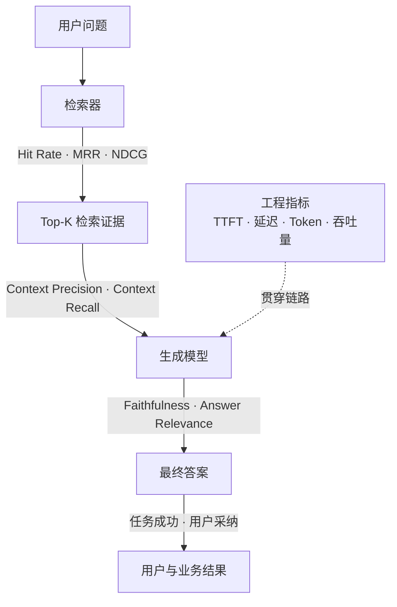
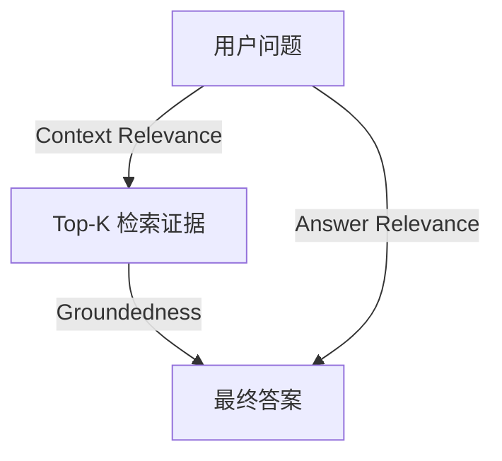
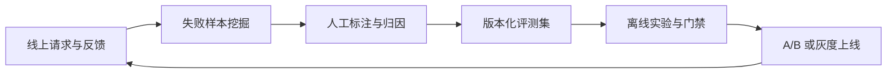

RAG 系统最容易制造一种错觉：只要最终答案读起来正确，整条链路就是健康的。

但一个答案可能因为检索器碰巧命中而正确，也可能引用了错误证据，却依靠模型参数记忆答对；一次离线评测得分很好，上线后仍可能因并发、权限、数据过期或用户问题分布变化而失效。只看一个“答案准确率”，既无法定位故障，也无法指导优化。

一个可落地的 RAG 评估体系，至少要回答六个问题：

1. 正确证据有没有被召回？
2. 召回结果是否把有用证据排在前面，并减少噪声？
3. 生成答案是否忠于证据、回答了问题且覆盖完整？
4. 整条链路能否正确回答、正确引用，并在证据不足时拒答？
5. 系统是否满足延迟、吞吐量、成本与稳定性要求？
6. 用户是否愿意采纳答案，业务结果是否真的改善？

本文按照“质量指标 → 评测数据 → 评估工具 → 结果校准 → 线上闭环”的顺序展开。目标不是堆砌指标名词，而是建立一套能够定位问题、支持上线门禁并持续运营的评估体系。

## 一、为什么 RAG 不能只看一个分数



这里的“Top-K 检索证据”就是检索器最终选出并送给生成模型的若干文档片段。把它单独画出来，是为了区分“检索器有没有找到正确内容”和“最终送入模型的证据是否完整、干净”这两个问题。

传统信息检索指标依赖相关性标注，适合精确比较 Retriever、Embedding、混合检索与 Rerank。RAG 特有指标更多使用问题、上下文、参考答案和生成答案之间的关系，常由 LLM-as-a-Judge（大模型裁判）完成。工程和业务指标则来自 Trace、网关、计费与产品埋点。

下面是一张可作为项目指标字典起点的总表。

| 指标名称 | 评估阶段 | 含义解释 | 所需数据 |
| --- | --- | --- | --- |
| Precision@K | 检索 | Top-K 中相关结果的占比，衡量噪声多少 | Query、Top-K、Chunk 相关性标注 |
| Recall@K | 检索 | Top-K 覆盖全部相关证据的比例，衡量是否漏召回 | Query、Top-K、完整相关证据集 |
| Hit Rate@K | 检索 | Top-K 中至少出现一个相关结果的 Query 比例 | Query、Top-K、至少一个正确证据标注 |
| MRR | 检索 | 首个相关结果排名倒数的均值，越接近顶部越好 | Query、排序结果、二元相关性标注 |
| MAP@K | 检索 | 多个相关结果在不同位置上的平均精度 | Query、排序结果、完整二元相关性标注 |
| NDCG@K | 检索 / Rerank | 对相关等级和排序位置同时计分，适合多级相关性 | 排序结果、0～n 级相关性标注 |
| Context Precision | 上下文 | 有用 Chunk 是否集中在上下文前部，减少噪声 | Query、检索上下文、参考答案或相关性判断 |
| Context Recall | 上下文 | 参考答案中的必要信息有多少能在上下文中找到 | 检索上下文、参考答案或参考证据 |
| Context Relevance | 上下文 | 检索上下文与用户问题是否相关 | Query、检索上下文 |
| Context Utilization | 上下文 / 生成 | 送入模型的上下文是否真正被答案使用 | Query、检索上下文、生成答案 |
| Faithfulness / Groundedness | 生成 | 答案中的断言有多少得到检索上下文支持 | 生成答案、检索上下文 |
| Answer Relevance | 生成 | 答案是否直接回应用户问题；不等同于事实正确 | Query、生成答案 |
| Answer Correctness | 生成 / 端到端 | 答案事实与标准答案是否一致 | 生成答案、参考答案，必要时参考证据 |
| Completeness | 生成 | 标准答案所需要点是否被完整覆盖 | 生成答案、参考答案或要点清单 |
| Citation Correctness | 端到端 | 引用是否真的支持其对应断言 | 答案断言、引用映射、源文档 |
| Citation Completeness | 端到端 | 需要证据的断言中有多少附带有效引用 | 答案断言、引用映射、源文档 |
| Refusal Accuracy | 端到端 | 可回答时回答、不可回答时拒答的能力 | 可回答性标签、生成答案 |
| P50/P95/P99 延迟 | 工程 | 描述典型体验和尾部慢请求，不能只看平均值 | 请求起止时间、Trace |
| TTFT | 工程 / 体验 | 从请求到首个输出 Token 的时间 | 请求时间、首 Token 时间 |
| TPS / TPOT | 工程 / 体验 | 每秒输出 Token，或相邻输出 Token 的平均耗时 | 流式 Token 时间戳 |
| Throughput | 工程 | 单位时间成功完成的请求或 Token 数 | 请求日志、时间窗口、成功状态 |
| Token / Cost per Answer | 工程 / 成本 | 每次成功答案的输入、输出、缓存与评估开销 | Provider 用量、模型价格、成功标签 |
| Error / Timeout Rate | 工程 | 调用失败、超时、限流与回退比例 | 网关日志、错误码、Trace |
| 点赞率 / 点踩率 | 用户体验 | 显式满意度信号，但存在选择偏差 | 用户反馈事件、曝光量 |
| 用户采纳率 | 用户体验 / 业务 | 答案被复制、引用、执行或确认解决的比例 | 产品行为埋点、任务结果 |
| 任务成功率 | 业务 | 用户是否完成目标，而不只是喜欢答案 | 业务完成事件、会话与任务关联 |
| Escalation Rate | 业务 | 转人工、重新搜索或重复提问的比例 | 会话日志、人工工单、搜索行为 |

这张表不是要求所有团队一次性全上。正确做法是为每个阶段选择一个主指标和若干护栏指标，避免优化单一分数时伤害其他目标。

## 二、检索与上下文指标

检索评估的前提是定义“相关”。对 RAG 来说，语义相似不一定代表可以回答。例如用户问“差旅住宿标准”，一段介绍差旅审批流程的文本很相似，却不包含金额与适用条件。

建议使用三级或四级标注：

| 等级 | 定义 | 示例 |
| --- | --- | --- |
| 0 | 无关，不能帮助回答 | 其他制度中的相似术语 |
| 1 | 主题相关，但不能直接回答 | 住宿报销流程，不含标准 |
| 2 | 包含部分必要证据 | 有金额，但缺城市或职级条件 |
| 3 | 可直接支持答案 | 金额、城市、职级、版本均完整 |

二元指标可以把 `2～3` 视为相关，也可以仅把 `3` 视为相关；关键是把口径记录下来并保持一致。

### 2.1 Precision@K、Recall@K 与 Hit Rate@K

```text
Precision@K = Top-K 中相关结果数 / K

Recall@K = Top-K 中相关结果数 / 该 Query 的全部相关结果数

Hit Rate@K = Top-K 至少命中一个相关结果的 Query 数 / Query 总数
```

- **Precision@K** 关注噪声。上下文窗口有限、模型容易被干扰时尤其重要。
- **Recall@K** 关注遗漏。总结、对比、多跳问答往往需要多条证据，只命中一条还不够。
- **Hit Rate@K** 只判断“有没有”，适合单事实 FAQ，但无法区分命中一条和命中全部证据。

不要把 Hit Rate 和 Recall 混用。某个多证据问题需要 4 个事实，系统只找到 1 个时，Hit Rate 仍然是 1，而 Recall 只有 0.25。

### 2.2 MRR：第一条有效证据出现得有多早

MRR（Mean Reciprocal Rank，平均倒数排名）只关注第一个相关结果：

```text
MRR = (1 / |Q|) × Σ 1 / rank_first_relevant(q)
```

首个正确 Chunk 排名第 1，得分为 1；排名第 5，得分为 0.2；没有命中，得分为 0。它适合“找到一个正确答案即可”的导航、FAQ 和单事实查询。

MRR 的盲区也很明显：排名第一之后的其他相关证据不会影响分数。因此，多跳问答不能只看 MRR。

### 2.3 MAP 与 NDCG：评估多个证据和相关性等级

MAP（Mean Average Precision）会在每个相关结果出现的位置计算 Precision，再对 Query 求均值，适合一个问题对应多个二元相关结果的场景。

NDCG（Normalized Discounted Cumulative Gain）则允许不同相关等级，并对靠后结果进行位置折损：

```text
DCG@K = Σ(i=1...K) (2^rel_i - 1) / log2(i + 1)
NDCG@K = DCG@K / IDCG@K
```

其中 `rel_i` 是第 `i` 个结果的相关等级，`IDCG` 是理想排序的 DCG。NDCG 很适合比较 Rerank 前后是否把“可直接回答”的证据推到了顶部。

### 2.4 Context Precision 与 Context Recall

传统 IR 指标通常依赖人工标注的相关文档或 Chunk。RAGAS 则提供了更贴近 RAG 输入输出的上下文指标。

根据 [RAGAS Context Precision 官方说明](https://docs.ragas.io/en/stable/concepts/metrics/available_metrics/context_precision/)，Context Precision 评估相关 Chunk 是否排在不相关 Chunk 之前；它按相关结果位置聚合 `Precision@k`，因此不仅看相关结果比例，也关心排序。

[Context Recall](https://docs.ragas.io/en/stable/concepts/metrics/available_metrics/context_recall/) 关注参考答案中的必要断言有多少可以归因到检索上下文。它可以直接比较参考 Context ID，也可以拆解参考答案中的 Claims（断言）后，用 LLM 判断检索上下文是否支持这些断言。

二者回答的是不同问题：

- Context Precision 低：召回噪声多或排序差；
- Context Recall 低：关键证据根本没有进入上下文；
- Precision 高、Recall 低：结果很干净，但漏掉了必要证据；
- Recall 高、Precision 低：证据找全了，但模型同时收到大量干扰。

这里还有一个容易踩的坑：用生成答案代替标准答案判断 Context 是否有用，可能形成“答案错了，检索也被判错”的循环依赖。有标注条件时，应优先使用参考证据或参考答案；无标注线上监控才采用弱监督 Judge。

## 三、生成质量指标

生成阶段评估关注模型本身是否会用证据回答。为了隔离 Retriever 的影响，离线实验可以给不同模型提供同一组标准 Context，再比较 Faithfulness、Relevance、Correctness 与 Completeness。它们看起来相近，实际不能互相替代。

### 3.1 Faithfulness：答案是否忠于检索证据

Faithfulness（忠实度）衡量答案断言能否由给定上下文推出。RAGAS 的典型计算方式是：先把答案拆成原子断言，再逐条判断是否被上下文支持，最后计算支持断言占比。[RAGAS 官方文档](https://docs.ragas.io/en/stable/concepts/metrics/available_metrics/faithfulness/)给出的核心形式是：

```text
Faithfulness = 被上下文支持的答案断言数 / 答案断言总数
```

它是检测“外源性幻觉”的核心指标，但不能证明知识库本身正确，也不能证明答案满足用户问题。

例如上下文错误地写着“住宿标准为 8000 元”，模型照抄后 Faithfulness 很高，但事实依旧错误。因此必须同时评估 Answer Correctness 和知识源质量。

### 3.2 Answer Relevance：答案是否真正回应问题

Answer Relevance（回答相关性）判断输出是否直接、恰当地回应用户意图，并惩罚跑题、答非所问和过多无关信息。它不负责判断事实真伪。

RAGAS 的 [Response Relevancy](https://docs.ragas.io/en/latest/concepts/metrics/available_metrics/answer_relevance/) 会基于答案反向生成若干可能的问题，再比较这些问题与原始问题的 Embedding 相似度。若从答案很难还原原问题，通常说明答案偏题或信息不足。

典型组合如下：

| Faithfulness | Answer Relevance | 可能现象 |
| --- | --- | --- |
| 高 | 高 | 证据支持且正面回答，仍需检查知识源正确性和完整性 |
| 高 | 低 | 内容来自上下文，但没有回答用户真正的问题 |
| 低 | 高 | 回答很像正确答案，却加入了上下文没有支持的内容 |
| 低 | 低 | 检索、Prompt 或模型行为可能同时存在问题 |

### 3.3 Answer Correctness 与 Completeness

Answer Correctness（答案正确性）比较生成答案与参考答案在事实上的一致性，通常结合事实断言匹配和语义相似度。Completeness（完整性）则看标准答案所要求的要点是否全部覆盖。

两者必须分开。例如用户问“报销上限是多少，有哪些例外？”模型只回答了正确金额：Correctness 可能不低，但 Completeness 明显不足。

对金额、日期、编号、计数和枚举值，不要完全依赖 LLM Judge。应先结构化提取，再用 Decimal、日期解析、集合比较或 Exact Match 做确定性校验。LLM 更适合判断语义等价和限定条件，而不是替代所有程序化断言。

### 3.4 有用性、风格与安全性

“语义相关”不等于“对用户有用”。生产系统还应按业务选择以下指标：

- **Actionability（可执行性）：** 是否给出用户下一步能执行的结论或步骤；
- **Clarity / Conciseness：** 是否清楚、简洁，没有过度展开；
- **Instruction Following：** 是否满足格式、语言、引用和结构要求；
- **Safety：** 是否包含有害内容、越权建议、隐私泄露或敏感信息；
- **Policy Compliance：** 是否遵守业务政策与合规规则；
- **Robustness：** 面对错别字、口语、提示注入和对抗问题时是否稳定。

这些指标通常需要 Rubric（评分量规）。“答案是否好”过于模糊；“关键结论是否位于前两句、是否包含操作入口、是否杜绝未经证据支持的金额”才是可复现的评分标准。

## 四、端到端质量指标

端到端评估不再给模型固定的标准 Context，而是让真实链路从 Query 开始完成检索、上下文组装和生成。此时部分指标名称会与生成阶段重复，但评估对象不同：前者用于隔离生成模型，后者用于验收整个系统。

组件指标优秀，端到端仍可能失败。Chunk 在召回结果里，却可能因截断没有进入 Prompt；引用 ID 在拼接时错位；生成答案正确，却引用了不支持该结论的来源。

### 4.1 端到端正确性与任务成功

推荐至少评估：

- **Exact Match / F1：** 适合短答案、实体、枚举与固定字段；
- **Semantic / Factual Correctness：** 适合开放式答案；
- **Task Success Rate：** 是否完成查询、比较、总结或操作目标；
- **Multi-turn Goal Completion：** 多轮对话后是否解决问题，而非单轮得分；
- **Freshness Accuracy：** 涉及时效的问题是否使用当前有效版本；
- **Permission Correctness：** 是否只基于用户有权访问的证据回答。

### 4.2 引用质量

带引用不等于可追溯。引用评估至少拆成两项：

```text
Citation Correctness = 能支持对应断言的引用数 / 全部引用数

Citation Completeness = 有有效引用的可验证断言数 / 全部应引用断言数
```

还可以补充 Citation Entailment，判断引用文本是否蕴含对应断言；Citation Attribution，检查链接、页码、章节和版本是否准确。引用必须与答案中的具体 Claim 建立映射，不能只在结尾堆一组来源。

### 4.3 拒答能力

RAG 系统必须评估“什么时候不该回答”。把测试集划分为可回答和不可回答两类，构造混淆矩阵：

| 标注 \ 系统行为 | 回答 | 拒答 |
| --- | --- | --- |
| 可回答 | 正确回答或错误回答 | 过度拒答 |
| 不可回答 | 幻觉 / 越界回答 | 正确拒答 |

由此可计算拒答 Precision、Recall、F1，以及更直观的：

- **Unsupported Answer Rate：** 无足够证据却仍回答的比例；
- **Over-refusal Rate：** 明明可回答却拒绝的比例；
- **Selective Accuracy：** 只统计系统选择回答的样本准确率；
- **Coverage：** 系统选择回答的样本比例。

高风险场景通常宁可降低 Coverage，也要提升 Selective Accuracy；通用搜索助手则需要平衡过度拒答带来的体验损失。

## 五、工程与成本指标

### 5.1 延迟要按阶段和分位数拆解

端到端延迟建议拆成：

```text
总延迟 = Query 处理 + 检索 + Rerank + 上下文组装
        + Provider 排队 + Prefill + Decode + 后处理
```

核心指标包括：

- **TTFT（Time To First Token）：** 请求进入到第一个 Token 返回；
- **TPOT（Time Per Output Token）：** 首 Token 之后，每个输出 Token 的平均时间；
- **TPS（Tokens Per Second）：** 输出阶段每秒生成 Token 数；
- **E2E Latency：** 请求到完整答案结束；
- **P50/P95/P99：** 典型、尾部和极端延迟；
- **Queue Time：** 服务排队耗时，避免把容量问题误判为模型问题。

流式响应主要改善感知延迟，不能降低检索和 Prefill 的实际工作量。因此 TTFT 和完整响应时间必须同时看。

这里的 TPS 通常指单次生成请求的 Decode 速度；系统级 Token Throughput 则是所有并发请求在单位时间内处理的 Token 总量。二者名称相近，但一个反映单用户生成速度，另一个反映整体容量。

### 5.2 吞吐量、容量与稳定性

Throughput（吞吐量）应至少记录 RPS/QPS 和 Tokens per Second，并在明确并发数、输入输出长度及成功率的前提下比较。单独宣称“100 QPS”没有意义，因为短答案、长上下文与多轮 Rerank 的负载完全不同。

生产监控还应包含：

- 成功率、超时率、429 限流率和 5xx 错误率；
- 检索空结果率、Rerank 回退率和模型降级率；
- 缓存命中率，以及真正节省的 Cached Token 比例；
- 并发数、队列深度、CPU/GPU 利用率与内存水位；
- 可用性、SLO 达标率和每次成功请求的资源消耗。

### 5.3 Token 和成本要算“每个成功任务”

至少拆分输入、输出、缓存读写、Embedding、Rerank、Judge 和重试成本。更有业务意义的口径是：

```text
Cost per Successful Answer = 总调用成本 / 正确且完成任务的答案数
```

如果一个便宜模型导致重试、转人工和错误答案增加，那么它的单次调用成本很低，单个成功任务成本却可能更高。

## 六、用户与业务指标

离线指标告诉我们系统“可能好用”，线上指标才说明它是否真的创造价值。

### 6.1 显式反馈

- 点赞率、点踩率；
- 1～5 分满意度；
- “答案有帮助 / 不准确 / 已过期 / 引用错误”等原因标签；
- 用户文本反馈与人工归因。

点赞率必须以答案曝光量为分母，并记录反馈覆盖率。主动反馈的用户通常不是随机样本：特别满意和特别不满的人更愿意点击，因此不能把点赞率直接当作准确率。

### 6.2 隐式反馈与采纳

- 答案复制率、引用点击率、下载率；
- 推荐操作的执行率；
- 用户采纳率或客服建议采纳率；
- 同一问题重复提问率、改写率、返回搜索率；
- 转人工率、工单重开率、平均解决时长；
- 会话放弃率和任务完成率。

“复制答案”可能代表采纳，也可能只是拿去核实。隐式行为要结合后续任务结果解释，不能脱离业务链路单独定性。

### 6.3 业务结果

不同业务最终应绑定不同 Outcome：客服关注一次解决率和平均处理时长；企业搜索关注找到答案的时间；研发助手关注建议接受率与缺陷率；销售助手关注准备时间和转化率。

线上 A/B 测试应同时设置质量、延迟与安全护栏。若任务成功率提升 2%，但错误引用率翻倍，就不能只宣布实验胜出。

## 七、评测集建设

明确指标后，下一步不是立即选择工具跑分，而是准备统一的测试题与判分依据。否则不同方案使用不同问题、不同标准答案，得到的分数无法公平比较。

Ground Truth 不只是“标准答案”。对 RAG 来说，它还应说明哪些证据与问题相关、答案必须包含哪些事实，以及这个问题是否应该被系统回答。

### 7.1 先定义标注口径

标注前先统一四类判断标准：

| 标注对象 | 需要回答的问题 | 主要用于哪些指标 |
| --- | --- | --- |
| Query 类型 | 这是单事实、多证据、多跳、对比还是总结问题 | 分组统计、失败归因 |
| 证据相关性 | 哪些文档或 Chunk 能直接支持答案，相关等级是多少 | Recall、MRR、NDCG、Context Precision |
| 参考答案与必要断言 | 正确答案是什么，必须覆盖哪些条件和例外 | Correctness、Completeness、Context Recall |
| 可回答性 | 当前知识库和用户权限下是否有足够证据回答 | 拒答准确率、Coverage |

如果“相关证据”的定义没有统一，同一个 Chunk 可能被不同标注员分别判断为相关和无关，检索指标便失去意义。建议先用少量样本试标，解决分歧后再扩大规模。

### 7.2 将标注结果组织成可回放样本

每条样本可以采用下面的结构：

```json
{
  "query": "上海出差的住宿上限是多少，有哪些例外？",
  "query_type": "multi_evidence_fact",
  "answerability": "answerable",
  "reference_answer": "……",
  "reference_context_ids": ["travel-v7#4.2", "travel-v7#4.5"],
  "reference_spans": [
    {"document_id": "travel-v7", "section": "4.2"},
    {"document_id": "travel-v7", "section": "4.5"}
  ],
  "required_claims": ["住宿上限", "适用职级", "例外审批条件"],
  "metadata": {
    "tenant": "demo",
    "language": "zh-CN",
    "risk_level": "high",
    "effective_at": "2026-09-03"
  }
}
```

基准层应保留稳定的文档版本、章节或原文范围，并记录知识生效时间与用户权限。Chunk ID 可以作为当前流水线的派生字段，但不应成为唯一 Ground Truth：一旦更换切分策略，Chunk ID 会变化，而原文证据范围仍应能够重新映射。这样才能公平比较不同 Chunking 方案，并复现时效与越权问题。

### 7.3 同时覆盖真实分布和高风险边界

评测集至少应包含：

- 高频 FAQ、长尾问题、模糊问题和多轮追问；
- 单事实、多证据、多跳、对比、总结和时效查询；
- 无答案、矛盾证据、旧版本和权限受限问题；
- 错别字、缩写、口语、中文英文混合；
- 提示注入、恶意文档、隐私与越权测试；
- 线上点踩、转人工和零结果样本。

这些样本最好分成三个用途不同的集合：

- **固定回归集：** 长期冻结，用于比较不同版本，防止旧能力退化；
- **挑战集：** 集中放置多跳、矛盾证据、提示注入等高难度和高风险案例；
- **线上回流集：** 定期吸收点踩、转人工和新出现的用户表达，用于反映分布变化。

报告总分时，还要按 Query 类型、租户、语言、文档类型、风险等级和答案长度分 Slice（切片）。平均分很容易掩盖局部失败，例如整体 Recall 提升，但权限受限问题的错误回答率同时上升。

## 八、框架落地：RAGAS 与 TruLens

评测集准备完成后，才进入工具选型。RAGAS 和 TruLens 都能减少指标实现与数据记录的重复工作，但它们组织指标的方式不同。

### 8.1 TruLens：用 RAG Triad 定位链路故障

TruLens 明确定义了 RAG Triad（RAG 评估三元组）。根据 [TruLens 官方文档](https://www.trulens.org/getting_started/core_concepts/rag_triad/)，它检查问题、检索证据和最终答案之间的三条关系：

| 三元组指标 | 检查的关系 | 它回答的问题 | 分数低时优先排查 |
| --- | --- | --- | --- |
| Context Relevance | Question → Context | 检索证据是否与用户问题相关 | Query 改写、检索器、过滤与 Rerank |
| Groundedness | Context → Answer | 答案中的断言是否得到证据支持 | Prompt、上下文干扰、模型幻觉 |
| Answer Relevance | Question → Answer | 最终答案是否真正回答原问题 | 意图理解、答案组织、无关扩写 |



这不是新的评估阶段，而是把前文指标映射回 RAG 的三类输入输出关系：

- Context Relevance 低，优先检查检索；
- Context Relevance 高而 Groundedness 低，优先检查生成；
- 前两者都高而 Answer Relevance 低，答案可能有据可依却答非所问。

TruLens 通过 Trace 记录问题、检索结果、模型答案和调用过程，再把 Feedback Functions（反馈函数）绑定到对应字段。当前 API 也提供用于构造三类反馈函数的 [`rag_triad`](https://www.trulens.org/reference/trulens/feedback/feedback/) 辅助能力。

三项得分都高，也只表示系统在当前知识库和评估器能力边界内表现良好。它不能自动证明知识库真实、最新、权限正确，也不能替代延迟、成本、安全与业务指标。

### 8.2 RAGAS：按数据条件组合指标

RAGAS 并没有把自身固定定义为同一个“三元组”。它提供一组可以按评估目标和数据条件选择的指标；[官方指标列表](https://docs.ragas.io/en/latest/concepts/metrics/available_metrics/)包括 Context Precision、Context Recall、Noise Sensitivity、Response Relevancy、Faithfulness，以及多模态和其他任务指标。

一个常见的最小组合是：

| RAGAS 指标 | 对应评估对象 | 关注点 | 典型输入 |
| --- | --- | --- | --- |
| Context Precision | 检索证据 | 相关 Chunk 是否靠前、噪声是否靠后 | `user_input`、`retrieved_contexts`、`reference` |
| Context Recall | 检索证据 | 检索证据是否覆盖参考答案要点 | `retrieved_contexts`、`reference` |
| Faithfulness | 生成答案 | 生成断言是否受检索证据支持 | `response`、`retrieved_contexts` |
| Response Relevancy | 用户问题与答案 | 回答是否贴合原始问题 | `user_input`、`response` |

两套框架的部分指标在语义上相近，但不能直接互换。RAGAS 把上下文质量进一步拆成 Precision 与 Recall；TruLens Triad 用 Context Relevance 表达 Question–Context 关系，并强调通过三条边定位故障。同名或近义指标也可能因为 Judge 模型、评分 Prompt 和聚合方式不同而得出不同分数，因此不能跨框架照搬阈值。

### 8.3 不要把框架分数直接平均

假设 Context Recall 为 0.4、Faithfulness 为 1.0，真实情况只是模型忠实回答了残缺证据；简单平均得到 0.7，反而掩盖了漏召回。

更稳妥的方式是：

- 为关键指标设置上线硬门槛，例如高风险领域的 Faithfulness 和 Citation Correctness 不得低于阈值；
- 按 Query 类型分别统计，避免 FAQ 的高分掩盖多跳问题；
- 综合分只用于实验排序，同时保留所有分项指标；
- 安全、越权和数据泄露等指标使用“一票否决”，不能被平均分稀释。

## 九、评估可信度

有了评测集，还需要决定每项指标由谁计算。最稳妥的原则是：能够用代码精确判断的内容交给确定性规则，必须理解语义的内容交给 LLM Judge，高风险和争议样本保留人工复核。

### 9.1 能确定性计算的指标，不要交给 LLM 猜

以下任务优先使用代码或人工标注结果：

- 文档 ID 命中、排名和相关等级：计算 Hit Rate、MRR、Recall、NDCG；
- 金额、日期、编号和枚举：使用 Exact Match、Decimal、日期与集合比较；
- 延迟、Token、吞吐量和错误率：直接读取 Trace、网关和计费日志；
- 引用链接、页码和版本：检查结构化引用映射；
- 权限过滤：根据 ACL（访问控制列表）执行确定性校验。

LLM Judge 可以帮助判断某段证据是否蕴含一个自然语言断言，但不应该代替可以直接验证的数值和系统事件。

### 9.2 用人工金标准校准 LLM-as-a-Judge

LLM Judge 具有顺序偏差、长度偏好、自我偏好和 Prompt 敏感性。上线前应：

1. 由领域专家双人标注一批 Gold Set（金标准集）；
2. 定义包含正反例的清晰 Rubric；
3. 比较 Judge 与人工标签的一致性，如 Cohen's Kappa、Spearman 相关或分类 F1；
4. 固定 Judge 模型、版本、Prompt、Temperature 和解析逻辑；
5. 对分歧样本和临界分数定期人工复核；
6. 模型或 Prompt 升级后重新校准，不能沿用旧阈值。

LLM Judge 适合规模化语义评估，不应替代高风险事实的确定性验证与人工抽检。

### 9.3 分数必须带上样本量和不确定性

两个方案的 Faithfulness 分别为 0.82 和 0.84，并不意味着后者一定更好。如果评测集很小，差异可能只是抽样或 Judge 波动。

报告结果时至少应包含：

- 样本数、均值以及关键分位数；
- 按 Query 类型和风险等级拆分的结果；
- 置信区间或 Bootstrap 重采样结果；
- 同一批样本上的成对比较，而不是比较两个不同数据集的均值；
- Judge 模型、Prompt、指标实现和评测集的版本号。

对于 LLM Judge 这类非确定性评估，还可以对临界样本重复评分，观察方差。只有超过业务可接受差异、统计波动和运行成本的提升，才值得进入灰度实验。

## 十、离线到线上评估闭环

一个务实的评估流程可以分为四层：

### 10.1 组件级离线回归

- Retriever：Hit@K、Recall@K、MRR、NDCG；
- Reranker：NDCG 增益、Top-K Recall 保留率；
- Generator：Faithfulness、Answer Relevance、Correctness；
- 引用与拒答：Citation Correctness、Unsupported Answer Rate。

每次更换 Embedding、Chunk、索引、Prompt 或模型，都在同一冻结数据集上比较，并保存配置版本。

### 10.2 端到端质量门禁

在完整链路中回放真实 Query，检查任务成功、引用、权限、时效、拒答与安全。关键指标使用硬阈值，其他指标比较相对基线和置信区间。

### 10.3 性能与容量测试

使用接近生产的输入长度、并发和输出长度，测量 TTFT、P95/P99、吞吐量、错误率与每次成功任务成本。不要用单用户短 Prompt 压测结果预测生产容量。

### 10.4 线上反馈与数据回流

把点踩、重复提问、零召回、转人工、低置信度和高延迟请求沉淀为候选样本，经脱敏、去重和人工审核后加入回归集。线上分布漂移则通过 Query 主题、长度、语言和 Embedding 分布监控发现。



## 十一、最小可行指标集

资源有限时，可以先建立下面这套 Minimum Viable Evaluation：

| 目标 | 主指标 | 护栏指标 |
| --- | --- | --- |
| 检索是否找得到 | Recall@K 或 Hit Rate@K | MRR、空结果率 |
| 检索排序是否合理 | NDCG@K 或 Context Precision | Context Recall |
| 生成是否有幻觉 | Faithfulness / Groundedness | Citation Correctness |
| 是否回答用户问题 | Answer Relevance | Completeness、过度拒答率 |
| 端到端是否可信 | Answer Correctness / 任务成功率 | 权限、时效、安全指标 |
| 体验是否可接受 | TTFT P95、E2E P95 | P99、超时率、TPS |
| 成本是否可持续 | Cost per Successful Answer | Token、缓存命中、重试率 |
| 用户是否认可 | 用户采纳率 / 任务完成率 | 点踩率、转人工率、重复提问率 |

如果业务涉及医疗、法律、金融、合同或企业敏感知识，还应将权限正确性、关键字段准确率、引用正确性和正确拒答设为硬门槛。

## 十二、常见误区

### “Faithfulness 高，答案就一定正确”

错误。Faithfulness 只证明答案受当前上下文支持；上下文可能过期、错误或不完整。

### “Hit Rate 很高，检索就没问题”

错误。它只要求命中一个相关结果，不关心其他必要证据是否遗漏，也不关心噪声和排名。

### “用 RAGAS 或 TruLens 跑一下就完成评估”

工具提供指标实现与可观测性，不会替你定义相关性、业务风险、标注规范和上线阈值。

### “把所有指标平均成一个总分最直观”

危险。平均值会掩盖低 Context Recall、越权泄露和无证据作答等致命问题。总分只能辅助排序，不能替代分项门禁。

### “LLM Judge 比人工便宜，所以可以完全替代人工”

错误。Judge 也会漂移和产生偏差，必须用人工 Gold Set 校准并持续抽检。

### “平均响应时间达标就可以上线”

错误。用户感受到的是 TTFT 和长尾延迟；容量不足往往首先体现在 P95/P99、排队时间和超时率。

## 结语：指标的目的不是证明系统优秀，而是让问题可定位

一套成熟的 RAG 评估体系，不应该只输出一个漂亮分数。它应该能告诉团队：答案失败是因为正确证据没有被召回、证据排序太靠后、上下文噪声过多、模型脱离证据生成、引用错位，还是系统在高并发下超时。

最实用的起点是：用 Recall@K 和 NDCG 看检索，用 Context Precision / Recall 看上下文，用 Faithfulness 和 Answer Relevance 看生成，再用端到端正确性、引用与拒答指标兜底；线上同时监控 TTFT、P95/P99、每个成功任务成本和用户采纳率。

最终，RAG 评估不是一次模型考试，而是一条持续运行的工程闭环：**离线可复现、线上可观测、失败可归因、指标可回流、版本可比较。**
