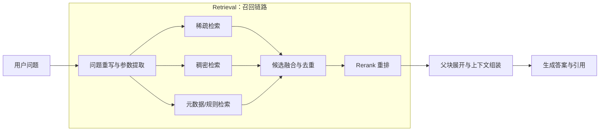

很多团队第一次优化 RAG，会先换更大的生成模型、扩充 Prompt，或者不断增加上下文长度。上线后却发现：答案依旧会张冠李戴，甚至一本正经地引用错误版本的制度。

原因并不神秘。生成模型只能基于送到它面前的证据作答；如果正确证据没有进入候选集，后面的 Prompt、Rerank 和大模型都没有补救空间。**生成决定答案表达得好不好，召回决定系统有没有机会答对。**

本文不绑定某个向量数据库或 RAG 框架，而是沿着一条生产链路，讨论如何把召回从“能搜到东西”优化为“稳定找对证据”。文中的案例是对企业知识库常见问题的归纳，重点不是某个产品参数，而是可复用的排查方法和工程取舍。

## 一、RAG 最难受的时刻：搜到了，但搜错了

生产环境里最常见的召回故障通常不是完全无结果，而是返回了**看起来非常相关、实际上不能回答问题**的内容。这比零命中更危险，因为生成模型会把相似内容组织成流畅答案。

### 1.1 语义混淆：相似制度之间张冠李戴

假设知识库同时存在以下文件：

- 《国内差旅管理办法（2025 版）》；
- 《海外差旅管理办法（2025 版）》；
- 《国内差旅管理办法（2023 版）》；
- 多个部门发布的补充说明。

用户问：“上海出差住宿上限是多少？”稠密检索很容易同时召回“住宿标准”“出差城市”“费用上限”等语义相似段落。如果 Chunk 没有携带适用地区、版本和部门元数据，向量距离无法表达这些业务约束，旧版或海外标准可能排在最前面。

这类问题表面上是模型“没看懂”，本质上通常是三个工程缺口叠加：

1. 解析阶段丢失标题与版本信息；
2. 查询阶段没有提取“上海”“国内”等过滤条件；
3. 检索阶段只按相似度排序，没有执行权限、时效和适用范围过滤。

### 1.2 专业术语零命中：业务知道它是谁，向量不知道

另一类典型问题来自缩写、料号、错误码和内部黑话。用户搜索“E37”“P0 故障”“XJ-4207”，正确文档可能写的是完整设备名或旧料号。通用 Embedding 擅长语义近似，却未必能稳定编码短字符串、数字组合和低频缩写；一旦文本又被 OCR 识别成 `E3T`，稠密召回几乎必然失效。

解决办法不是盲目更换 Embedding 模型，而是先承认：**语义相似、字面精确、业务约束是三种不同信号，不能指望一条向量包办。**

## 二、基础建设：先把文档变成“可召回的知识”

召回优化从来不只发生在查询时。垃圾解析结果经过再好的检索器，也只是更快地找到垃圾。

### 2.1 智能解析的目标不是纯文本，而是结构化证据

生产级解析至少应该保留：

- 标题树、段落、列表、表格、图片说明和代码块等结构；
- 文档 ID、版本、发布时间、来源系统、权限域、语言等元数据；
- 页码、章节路径、表格行列等可引用位置；
- 原文哈希、解析器版本、处理时间等可追溯信息。

例如，表格中的“800”单独拿出来毫无意义。索引文本至少要补全为“国内差旅 / 一线城市 / 住宿上限 / 800 元每晚”，并保留它来自哪张表、哪一行。补全不是让模型自由改写原文，而是将表头、章节标题和单元格关系序列化进可检索文本。

完整的文档接入和结构恢复细节，可以参考上一篇 [《RAG 文档解析工程》](/posts/rag-document-parsing-guide/)。这里强调一个容易忽略的边界：解析层负责忠实恢复结构，检索层负责根据查询选择证据，两者之间应该通过稳定的数据契约连接，而不是把所有逻辑塞进一个 Loader。

一个实用的 Chunk 数据结构可以包含：

```json
{
  "chunk_id": "doc_123#v7#section_4#chunk_2",
  "document_id": "doc_123",
  "document_version": 7,
  "section_path": ["差旅管理", "住宿标准", "一线城市"],
  "content": "……",
  "retrieval_text": "差旅管理 > 住宿标准 > 一线城市\n……",
  "valid_from": "2025-01-01",
  "permission_groups": ["all_employee"],
  "source_locator": { "page": 12, "table": 2, "row": 4 }
}
```

`content` 用于忠实引用，`retrieval_text` 用于增强命中，二者不要混为一谈。否则为了检索添加的标题、同义词或说明，可能被生成模型误当成原文。

### 2.2 动态分块：按知识边界切，不按字符数切

固定长度切分可以作为兜底，但不能成为所有文档的默认答案。更稳妥的策略是“结构优先、Token 受控、类型感知”：

1. 先按标题、条款、段落、表格、代码函数等自然边界形成原子单元；
2. 在最大 Token 预算内合并相邻且主题一致的单元；
3. 超长单元再按句子或语义转折递归拆分；
4. 为每个子块保留父章节 ID 和相邻关系；
5. 召回时用小块定位，生成时按需展开父块或邻近窗口。

这就是常说的“小块召回、大块回答”。它解决了一个长期冲突：小块主题更纯，容易精准命中；大块上下文更完整，能保留前置条件与例外条款。

动态分块也不等于每次查询都重新切文档。工程上通常会预生成多粒度索引单元，例如句段级子块、章节级父块和文档级摘要，再由查询意图决定走哪一层。具体策略与参数评估可继续阅读 [《RAG 文档切分工程》](/posts/rag-document-chunking-strategies/)。

## 三、意图增强：不要拿用户原话直接撞索引

真实用户不会按照知识库的写法提问。问题里可能有上下文省略、错别字、口语、代词，也可能把多个子问题揉在一起。Query Rewriting 的价值，是把“用户表达”转换为“可执行的检索计划”。

### 3.1 重写不是润色，而是生成多种检索表达

以“老员工去上海住店能报多少，最新的”为例，重写模块可以输出：

```json
{
  "normalized_query": "上海出差住宿费用报销上限",
  "keyword_query": "上海 住宿标准 报销上限",
  "semantic_queries": [
    "员工前往上海出差时，每晚酒店费用最高可报销多少",
    "国内一线城市差旅住宿标准"
  ],
  "filters": {
    "region": "国内",
    "city": "上海",
    "status": "生效中"
  },
  "intent": "fact_lookup",
  "need_latest_version": true
}
```

这里需要守住两个原则。

第一，**重写不能替用户补事实**。用户没有说明员工职级时，不能擅自生成“高级经理”；应该保留缺失字段，让检索返回不同职级的证据，或在答案阶段追问。

第二，**原始问题必须保留为一路查询**。大模型重写可能过度归一化，删除错误码、型号或否定词。原始 Query 是重要的保底信号，尤其适合关键词检索。

### 3.2 参数提取要走白名单和确定性校验

结构化过滤能显著减少语义混淆，但错误过滤比没有过滤更糟：一个误识别的部门条件可能直接把正确文档排除。

建议将过滤字段分为三类：

| 类型 | 例子 | 处理方式 |
| --- | --- | --- |
| 强约束 | 租户、权限域、明确产品型号 | 必须过滤，不允许降级绕过 |
| 业务约束 | 地区、部门、文档类型、有效期 | 高置信度时过滤，低置信度时用于加权 |
| 偏好信号 | “最近”“详细一点”“官方的” | 调整排序与召回计划，不直接裁掉候选 |

模型输出后还要经过 Schema 校验、枚举映射和日期归一化。例如“魔都”可以映射为“上海”，但只有业务词典确认后才能进入过滤表达式。所有过滤字段都应记录提取来源和置信度，方便线上回放。

### 3.3 根据意图选择召回策略

重写后的 `intent` 不只是一个日志字段，它应该影响实际执行计划：

- 料号、错误码、姓名查询：提高稀疏检索权重，扩大精确匹配通道；
- 概念解释、自然语言描述：提高稠密检索权重；
- 流程和总结问题：召回章节级候选，并允许展开更多相邻块；
- 对比问题：拆成多个子查询分别召回，再按实体分组；
- “最新”“当前”等时效问题：启用有效期过滤和版本排序。

Query Rewriting 的输出应该可缓存，但缓存键不能只有原始文本，还要包含租户、语言、用户权限摘要和重写策略版本，避免跨权限或跨版本复用错误计划。

## 四、核心架构：混合多路召回与 Rerank

稳定的召回链路通常不是一次 Top-K 查询，而是一组各有所长的检索器并行取候选，再经过融合、去重和重排。



严格来说，父块展开与上下文组装属于**召回后处理**，不是 Retrieval 本身。它负责将已经排好序的证据整理成模型可消费的上下文；本节只讨论到 Rerank 为止。

### 4.1 稀疏检索：守住精确字面信号

BM25 等稀疏检索对错误码、专有名词、数字和罕见词非常有效。中文场景中，分词词典、同义词表和字段设计往往比调一个权重更重要。

索引时可以将标题、正文、实体、别名拆成不同字段，给予不同权重。不要把权限条件、版本状态和正文关键词都塞进一个字符串；前者应该是过滤与排序特征，后者才是相关性特征。

稀疏检索的常见问题是同义表达覆盖不足。可以维护业务词典，也可以在 Query Rewriting 中生成关键词查询。但同义词扩展需要版本化和灰度验证，因为一个多义缩写的全局扩展，可能瞬间制造大量误召回。

### 4.2 稠密检索：补足表达差异

稠密检索适合“用户描述”和“文档表述”字面不同但含义接近的场景。它的效果依赖 Embedding 模型、索引参数、距离函数和数据分布。

这里有一个常见误区：离线换模型后只比较平均相似度。不同模型的分数分布不可直接横向比较，真正应该比较的是固定候选规模下的 `Recall@K`、`MRR`、首个有效证据排名，以及按查询类型拆分后的表现。

同时要警惕近似最近邻索引带来的第二层损失：即使正确文档在向量空间中足够接近，也可能因为搜索参数过于保守没有被算法找到。排查时应抽取问题样本，对比近似检索与小规模精确检索结果，区分“Embedding 没表达对”和“ANN 没搜索到”。

### 4.3 多路融合：先合并名次，不要硬加原始分数

稀疏分数和向量相似度不在同一个尺度上，直接做 `0.5 × BM25 + 0.5 × cosine` 通常缺乏稳定含义。一个技术栈中立、容易上线的起点是 Reciprocal Rank Fusion（RRF）：

```text
RRF(d) = Σ 1 / (k + rank_i(d))
```

它只依赖候选在每一路中的名次，对分数尺度不敏感。`k` 用于减小头部名次差异，一般应通过离线数据调优，而不是照抄固定值。

融合阶段还应处理三个问题：

1. **按稳定 ID 去重：** 同一 Chunk 可能被多路命中；
2. **按文档限制配额：** 避免一个长文档的相邻块占满候选集；
3. **保留来源特征：** 将各路名次、原始分数、命中字段传给 Reranker 和日志系统。

动态权重可以作为后续优化。例如错误码查询偏向稀疏通道，自然语言问答偏向稠密通道。但不要一开始就训练复杂路由模型。先用可解释规则建立基线，并用失败样本证明静态融合确实不够。

### 4.4 Rerank：用更贵的模型判断“能否回答”

初始召回追求高 Recall，Rerank 负责提高 Precision。Cross-Encoder 或大模型重排器能同时读取 Query 和候选文本，判断它们是否真正相关，而不只是各自编码后比较距离。

一个常见配置是每路取几十条，融合去重后保留数十条进入 Rerank，最终选择少量证据。但具体数字必须受延迟、候选长度和业务难度约束。候选越多不一定越好：费用和延迟线性上涨，长尾噪声还可能挤占模型输入。

Rerank 的输入建议包含必要的标题路径、正文和关键元数据，但不要拼入整篇文档。重排之后再根据 `parent_id` 展开父章节或邻近块，并做总 Token 预算控制。否则“大块送入 Rerank”会同时拖慢服务并稀释相关信号。

最后，不要把 Rerank 分数当成绝对可信度。可以设置拒答阈值，但阈值必须按业务数据校准，并结合 Top-1 与 Top-2 分差、来源权威性、版本状态等特征综合判断。

## 五、分阶段量化：先知道答案在哪一层丢了

量化前先建立带相关性标注的评测集：每个 Query 至少标注可回答的 Chunk，并用 `0=无关、1=部分相关、2=可直接回答` 表示相关等级。指标必须按事实、术语、流程、对比等查询类型分桶，否则平均值会掩盖局部退化。

### 5.1 解析指标

| 指标 | 计算方式 | 排查意义 |
| --- | --- | --- |
| 内容完整率 | 成功提取的有效语义单元数 / 标注的应提取单元数 | 低值说明正文、表格或 OCR 内容在索引前已经丢失 |
| 结构恢复 F1 | 对标题层级、列表、表格单元格等计算 Precision、Recall 与 F1 | 区分“文字存在但上下级关系错误”的问题 |
| 元数据完整率 | 必填元数据非空的 Chunk 数 / 全部 Chunk 数 | 定位版本、权限、来源位置无法过滤或引用的问题 |
| 异常 Chunk 率 | 空文本、乱码、超限或重复 Chunk 数 / 全部 Chunk 数 | 监控解析器升级是否批量制造脏数据 |

### 5.2 重写与参数提取指标

| 指标 | 计算方式 | 排查意义 |
| --- | --- | --- |
| 意图准确率 | 意图分类正确的 Query 数 / 已标注 Query 数 | 判断检索路由选错是否来自意图识别 |
| 槽位 F1 | 对地区、版本、型号等字段计算实体级 Precision、Recall、F1 | Precision 低会误过滤，Recall 低会留下语义混淆候选 |
| 语义保持率 | 未增添、删除或反转关键约束的重写数 / 抽检重写数 | 发现模型“润色”时改变原始问题含义 |
| 有效改写增益 | 改写后命中、原始 Query 未命中的样本数 / 全部样本数 | 判断增加改写调用是否真正贡献召回，而非只增加开销 |

### 5.3 单路召回指标

| 指标 | 计算方式 | 排查意义 |
| --- | --- | --- |
| Hit@K | Top-K 至少包含一个相关 Chunk 的 Query 数 / Query 总数 | 衡量该通道能否给后续阶段留下正确答案 |
| Recall@K | Top-K 中相关 Chunk 数 / 该 Query 全部相关 Chunk 数，再对 Query 求均值 | 适合需要多条证据的流程、对比和总结问题 |
| MRR | 首个相关 Chunk 排名倒数 `1/rank` 的均值 | 识别正确结果虽然命中却长期排在尾部的问题 |
| ANN Recall@K | 近似向量检索与精确 KNN 结果的重合数 / K | 区分向量表达问题与 ANN 索引参数问题 |

稀疏和稠密通道必须分别统计，不能只看混合后的总指标；否则无法知道应该调整词典、Embedding，还是近似索引搜索参数。

### 5.4 融合指标

| 指标 | 计算方式 | 排查意义 |
| --- | --- | --- |
| 融合 Recall@K | 融合 Top-K 中相关 Chunk 数 / 全部相关 Chunk 数 | 衡量合并、截断后是否保住各路正确候选 |
| 相对召回增益 | `(融合 Recall - 最佳单路 Recall) / 最佳单路 Recall` | 判断多路架构是否提供互补价值 |
| 通道独占贡献率 | 仅由某一路带入的相关 Chunk 数 / 融合相关 Chunk 数 | 识别可以裁撤的冗余通道或不可替代通道 |
| 候选重复率 | 合并前候选总数减去唯一候选数，再除以合并前总数 | 高值意味着 Top-K 和 Rerank 预算被重复块浪费 |

### 5.5 Rerank 指标

| 指标 | 计算方式 | 排查意义 |
| --- | --- | --- |
| NDCG@K | 按相关等级计算 DCG，再除以理想排序 IDCG | 衡量“可直接回答”的证据是否被排到更靠前位置 |
| MRR 变化量 | `MRR_重排后 - MRR_重排前` | 判断重排是否改善首个有效证据的位置 |
| Top-N 保留率 | 重排后 Top-N 中仍保留的相关 Chunk 数 / 重排前全部相关 Chunk 数 | 发现 Reranker 将正确证据压出最终候选集 |
| 困难负例压制率 | 排到相关证据之后的困难负例数 / 困难负例总数 | 专门衡量旧版本、相似制度等误召回能否被压下去 |

质量指标还应与各阶段 P95/P99 耗时、超时率、候选数和 Token 消耗关联观察，但这些是性能与成本约束，不应混入相关性指标的计算口径。

## 六、工程踩坑一：多路并发后，P99 延迟和资源一起失控

混合召回在架构图上只是三条并行箭头，在线上却可能变成资源放大器：一次用户请求被重写成三个 Query，每个 Query 又访问稀疏、稠密和规则通道，随后几十个候选进入 Rerank。原本一次检索，最终产生十几次下游调用。

### 6.1 排查不要只看接口总耗时

遇到超时时，建议按以下顺序拆解：

1. 为每个请求生成 `trace_id`，记录重写、各召回通道、融合、Rerank、上下文展开的开始时间和耗时；
2. 记录每路候选数、去重率、候选 Token 数、超时状态和连接池等待时间；
3. 对比 P50、P95、P99，而不是只看平均值；
4. 检查慢请求是否集中在特定租户、过滤条件、超长 Query 或高并发时段；
5. 区分服务计算慢、排队慢、网络慢和连接池耗尽。

很多场景中，向量查询本身只用了几十毫秒，真正的时间消耗在等待连接、重复 Embedding、Rerank 处理超长候选，或者某一路超时后上层仍傻等。

### 6.2 用“总预算”管理链路，而不是每层各设一个超时

假设接口的目标超时是 1200ms，不应该给四个阶段各配置 1200ms。入口应生成 Deadline，各阶段读取剩余预算：

```text
总预算：1200ms
重写与 Query Embedding：最多 200ms
多路召回：最多 350ms
融合与去重：最多 50ms
Rerank：最多 400ms
上下文组装及安全余量：200ms
```

这不是固定模板，而是一种控制方式。执行器需要支持：

- 并行通道独立超时，某个增强通道失败时允许降级；
- 到达 Deadline 后主动取消下游任务，避免“请求已失败、计算仍继续”；
- 限制每个请求的改写数、每路 Top-K、总候选数和总 Token 数；
- 对 Embedding、Rerank 分别设置并发信号量和有界队列；
- 熔断持续异常的下游，避免线程池和连接池被拖死。

降级必须区分强弱依赖。权限过滤、租户隔离不能降级；额外的语义扩展通道可以在超时时跳过。Rerank 不可用时，可以回退到融合名次，但日志和响应元数据必须标注降级，便于评估质量损失。

缓存也很有用，但应缓存确定性中间结果，例如标准化后的 Query Embedding、公开文档的检索结果。不要用不含权限摘要的 Key 缓存最终候选，更不能让缓存绕过实时 ACL 校验。

### 6.3 资源优化的判断依据是边际收益

把稠密通道的 Top-K 从 30 提到 100，如果 `Recall@融合候选` 只提升 0.3%，却让 Rerank Token 翻三倍，这通常不是划算的优化。建议绘制以下曲线：

- 每路 Top-K 与整体 Recall 的关系；
- 融合候选数与 Rerank 后 NDCG/MRR 的关系；
- 候选 Token 数与 P95/P99 延迟、费用的关系；
- 超时降级比例与最终答案正确率的关系。

只有把质量、延迟和成本放在同一张评估表里，才能避免“离线指标涨了，线上系统却扛不住”。

## 七、工程踩坑二：数据更新后，向量库和业务库各说各话

很多知识库将文档元数据保存在关系型数据库，将 Chunk 和向量保存在检索系统。最危险的实现是：业务事务提交后，应用同步调用向量库更新。任何一次网络抖动都可能造成“数据库是新版、索引仍是旧版”；反过来，也可能索引已经写入，业务事务却回滚。

### 7.1 先定义一致性语义

跨两个独立存储追求实时强一致，代价通常很高。RAG 更实用的目标是：

- 业务数据库是事实源；
- 索引允许短暂延迟，但最终一致；
- 旧版本不会与新版本同时作为有效证据；
- 删除和权限收紧必须高优先级传播；
- 所有异常都能检测、重放和修复。

### 7.2 使用 Outbox、幂等版本和索引别名

一种通用方案是 Transactional Outbox：在更新文档业务记录的同一数据库事务中，写入一条待处理事件。后台消费者读取事件，执行解析、切分、Embedding 和索引写入。

```text
业务事务：更新 document_version = 8
        └─ 同事务写入 outbox(document_id, version=8, event_id)

异步消费者：读取事件
        → 生成带版本的 Chunk
        → 写入暂存索引
        → 校验数量、哈希与权限字段
        → 原子切换当前版本/索引别名
        → 标记事件完成
```

每次写入都使用 `(document_id, version, chunk_id)` 作为幂等键。消费者重试时覆盖同版本数据，而不是不断追加副本。处理 version 7 的延迟任务时，如果事实源已经是 version 8，应直接丢弃旧事件，防止乱序覆盖。

对于整批重建，优先构建新索引并完成抽样校验，再原子切换别名；不要在正在提供查询的索引上边删边建。旧索引保留一个短暂回滚窗口，确认稳定后再清理。

### 7.3 建立对账任务，不能只相信消息“消费成功”

消息成功不代表索引正确。解析器可能输出空内容，Embedding 可能返回错误维度，权限字段也可能被漏写。建议周期性执行双向对账：

- 业务库有效文档数与索引中的当前版本文档数；
- 每个文档预期 Chunk 数与实际 Chunk 数；
- 原文版本、内容哈希、解析器版本、Embedding 模型版本；
- 已删除或已失效文档是否仍可被检索；
- 权限收紧后，旧权限候选是否彻底消失。

对账发现差异后，以事实源重新投递修复事件。修复流程也必须幂等，并对连续失败进入死信队列的任务告警。删除事件和权限变更事件应设置更高优先级；在索引尚未完成更新时，查询层仍需使用事实源或权威 ACL 服务做最终过滤，避免一致性窗口演变为数据泄露。

## 八、工程踩坑三：Rerank 上线了，正确答案反而被压下去

Reranker 不是天然适合所有领域。通用模型可能更偏好语句完整、解释充分的段落，却低估简短但精确的表格行、代码片段或错误码说明。

### 8.1 用分层指标定位是哪一层丢了答案

不要只统计最终回答正确率。至少建立四层指标：

| 层级 | 关键指标 | 回答的问题 |
| --- | --- | --- |
| 单路召回 | Recall@K、首个相关结果排名 | 哪种检索器能找到证据 |
| 融合候选 | Recall@K、来源覆盖率、去重率 | 融合是否丢失了正确候选 |
| Rerank | MRR、NDCG、Top-N Recall | 重排是否把正确证据压下去 |
| 召回后处理 | 证据完整率、冲突率、引用准确率 | 独立观察上下文组装，但不计入 Retrieval 指标 |

如果正确 Chunk 根本不在融合候选中，调 Rerank 没用；如果它在融合候选第 5 位、重排后掉到第 30 位，问题才属于 Rerank。线上日志应保存候选 ID、各路名次、重排前后分数和策略版本，但敏感正文应脱敏或只保存哈希与受控快照。

### 8.2 让评测集覆盖“困难负例”

随机抽一些普通问答，很难暴露张冠李戴。评测集应主动加入：

- 同主题不同年份的制度；
- 总部与分公司的相似规则；
- 只差一个字符的料号；
- 正文相似但适用对象不同的条款；
- 包含否定、例外和前置条件的问题；
- 答案跨两个 Chunk 才完整的问题。

这些“Hard Negative（困难负例）”才能检验 Reranker 是否理解适用条件。上线新模型时按查询类型分别比较，并保留旧模型做小流量对照。若表格类明显退化，可以先采用类型感知策略：表格候选拼接表头后重排，或为精确命中的候选加入受控加分，而不是立刻推翻整个架构。

## 九、把优化变成闭环，而不是一次调参

一套可持续的召回优化流程通常是：

1. 从无答案、点踩、人工纠错和低置信度请求中采集失败样本；
2. 标注正确文档、正确 Chunk、必要条件和可接受替代证据；
3. 回放各阶段结果，定位问题发生在解析、重写、单路召回、融合还是重排；若这些阶段均保留正确证据，再单独检查召回后的上下文组装；
4. 只修改对应层，并进行离线回归；
5. 灰度上线，观察质量、P99、成本和降级率；
6. 将新出现的困难样本沉淀回评测集。

建议所有核心策略都版本化：解析器、分块器、Embedding 模型、业务词典、Query Rewriting Prompt、融合参数、Reranker 和阈值。没有版本号的日志无法可靠回放，也无法判断一次线上回退究竟回退了什么。

## 十、总结

RAG 召回优化不是“换一个更好的向量模型”，而是一项跨数据、算法和在线系统的工程：上游要恢复结构并建立合适的知识边界，中间要理解查询意图并组合互补信号，最后在延迟和成本预算内完成重排。重排后的上下文组装属于另一层职责，应单独评估，避免用生成链路的问题污染 Retrieval 指标。

真正可靠的系统有两个共同点：一是每个阶段都可观测、可降级、可回放；二是用真实失败样本驱动优化，而不是凭感觉调 Top-K。算法决定质量上限，工程决定这个上限能否在每一次请求中稳定兑现。
