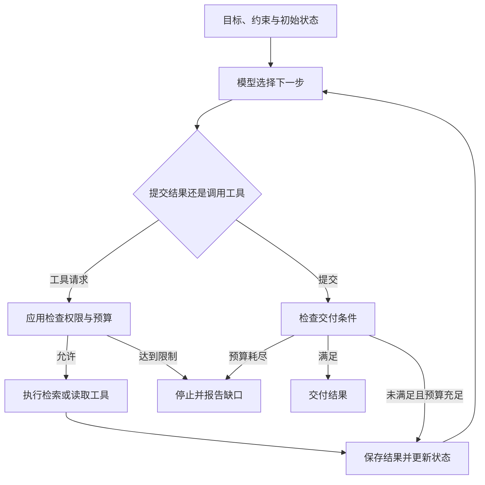
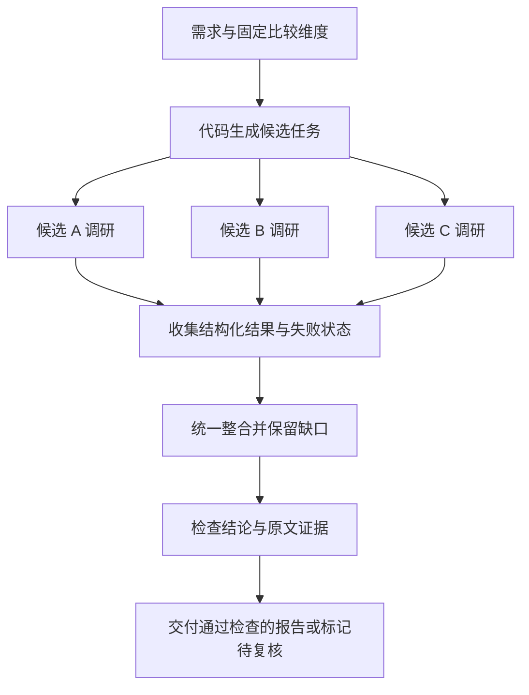

**文章论证主线：** 从技术选型助手的交付要求出发，建立模型调用、工作流与 Agent 的区别；先定位单 Agent 的瓶颈，再按控制权、依赖关系和检查机制理解协作模式；最后用最小编排示例与对照实验，把架构选择变成可以验证、也可以撤回的工程决策。

## 一、先明确交付物，再讨论 Agent

假设你要开发一个技术选型调研助手。用户输入：“我们需要一个团队知识库搜索方案，要求可以自托管、支持权限过滤，运维人员有限，请比较三个候选方案。”

助手需要提取硬性约束，查阅候选方案的官方文档，区分社区版与商业版能力，标出版本和适用条件，最后提交带证据的建议。它还要说明哪些问题尚未确认，以及这些缺口是否足以改变推荐。

直接把问题交给模型，往往能得到一张流畅的对比表。但表格完整，不代表资料是当前的，也不代表“支持权限过滤”适用于用户能部署的版本。真正的交付要求是：**结论可追溯，关键约束被检查，无法确认的地方被保留。**

如果所有资料已经由人整理好，一次模型调用可能足够。若资料需要临时搜索，页面之间存在矛盾，系统就需要读取反馈、调整查询，再决定是否继续调查。这时才出现引入 Agent 的理由。

本文采用教学性的工作定义与模式分类，不把它们视为某家机构的统一标准。引用用于支持具体事实；选型规则、案例和预算参数属于工程建议，未声称已取得实验收益。

## 二、四个概念，区别在谁决定下一步

**模型调用（Model Call）** 是一次请求与响应。你给出两段资料，模型生成比较结果。响应也可能是工具调用请求；真正执行工具通常由应用或运行时负责，不能把模型提出动作等同于动作已经发生。

**工作流（Workflow）** 由程序规定主要路径。例如“读取指定页面 → 提取字段 → 生成表格”，每一步可以调用模型，但先后顺序和分支条件主要由代码确定。

**智能体（Agent）** 在目标与约束内，根据工具反馈决定后续行动。它发现文档没说明社区版限制，于是选择继续搜索版本说明；证据足够后才提交结果。这里的自主性有边界：允许访问什么、最多执行几步、何时停止，都应由系统约束。

**多智能体（Multi-Agent）** 由多个具有独立职责或上下文的 Agent 协调完成任务。例如三个调研 Agent 分别调查一个候选方案，各自决定如何补充证据，再交给统一的整合环节。



工具提供能力，Agent 选择如何使用；状态记录已取得的证据、失败和剩余任务。停止不能只靠模型说“完成了”，还应有步数、时间和交付条件。OpenAI 的[工具调用文档](https://developers.openai.com/api/docs/guides/function-calling)将模型请求工具、应用执行工具、返回结果描述为不同环节。

因此，多次模型调用不自动构成多 Agent。工作流可以包含 Agent，Agent 也可以调用固定工作流；多个 Agent 可以使用相同模型，也可以串行运行。判断系统结构时，应查看控制流和状态边界，而非计算角色名称的数量。

## 三、单 Agent 遇到了什么，才值得拆分

第一版助手可以只有一个 Agent，配备搜索、读取官方页面和提交报告的工具。如果候选方案少、资料清晰，且它在测试任务上稳定满足要求，就没有必要继续拆分。

当结果不理想时，先检查轨迹。例如引用错误可能源于页面解析失败，遗漏约束可能源于输入不明确。增加 Agent 不会自动修复这些问题。值得尝试拆分的原因主要有三类。

### 3.1 工作能够独立进行

候选方案 A 的部署限制，通常不需要等 B 的资料读完才能调查。可以先固定比较维度，再让不同执行单元独立研究，最后统一比较。

串行耗时近似是各任务耗时之和；并行耗时近似是最慢任务耗时，加上分派、排队、整合与检查的开销。只有节省的串行等待足够大，并行才值得。若三个任务共享一个严格限流的搜索接口，增加并发也可能只增加重试。

### 3.2 上下文需要隔离

同时阅读多个产品文档时，模型可能把 A 的商业版能力写进 B 的开源版说明。将每个候选方案放在独立上下文中，有助于降低交叉干扰。

隔离也有代价：专家可能不了解全局约束。因此每个任务仍要收到同一份需求、比较维度和版本口径。返回时保存结论及证据，不能只交一句“支持”。OpenAI 的[多 Agent 指南](https://developers.openai.com/api/docs/guides/responses-multi-agent)将独立工作与聚焦上下文列为适用条件，同时提醒并发可能增加 Token 用量。

### 3.3 职责需要不同能力边界

调研者需要搜索工具，整合者需要全部候选结果，检查者需要原文及验收规则。分开配置可以让各环节的输入和责任更明确，但权限必须由运行时执行，角色提示词本身不构成隔离。

相反，严格依赖前一步、几分钟内就能完成、需要频繁修改同一报告，或者主要在等待一个慢服务的任务，未必适合拆分。优化工具、缩小输入或改善单 Agent 指令，可能更直接。**拆分应对应一个可测量的瓶颈，而不是仅对应一个新角色。**

## 四、七种模式，分别处理不同的问题

下面统一按“问题、控制流、案例、收益、代价与边界”介绍。它们可以组合：路由决定交给谁，主管与交接决定控制权，串行与并行决定执行关系，规划与评审决定如何调整过程。

### 4.1 流水线：阶段已知，顺序固定

当交付必须经过若干稳定阶段时，采用流水线（Pipeline）：提取需求 → 调研 → 比较 → 检查。例如先将用户要求转换为统一字段，再开始检索。

它便于逐阶段验收和定位错误，代价是上游错误会继续传播，串行延迟也会累加。若下一步高度依赖临时发现，固定流水线容易变得僵硬。阶段内部可以是普通函数、模型调用或 Agent，流水线本身不意味着多 Agent。

### 4.2 路由：不同请求需要不同处理能力

路由（Router）先判断请求类别，再选择处理分支。例如将“部署成本”交给运维方向，将“访问控制”交给权限方向。

它能缩小每个分支的工具和上下文范围，代价是分类错误会把任务送错地方。混合请求不能硬塞进单一类别，应拆分或走综合处理分支。若所有请求都需要全部能力，额外路由可能没有收益。

### 4.3 主管—专家：分工后仍需统一答复

主管—专家（Supervisor–Worker）解决统一交付的问题：主管分派任务，专家返回产物，主管处理冲突并整合建议。例如由主管分别调查部署、权限和维护成本。

它便于动态分工，最终答复责任也清楚；代价是主管可能拆错任务、遗漏专家的保留意见，并成为延迟瓶颈。任务边界已经固定时，代码调度通常更容易控制，无需额外模型负责分派。

OpenAI 的[编排与交接文档](https://developers.openai.com/api/docs/guides/agents/orchestration)用 agents-as-tools 表达由主 Agent 调用专家并保留答复责任的模式。专家返回的是局部产物，不是自动获得最终决定权。

### 4.4 并行汇总：独立任务一起执行

并行汇总（Fan-out/Fan-in）先展开任务，再收集结果。例如三个 Agent 分别调查 A、B、C，整合节点按相同维度生成对比表。

它可能缩短等待时间，也能扩大覆盖范围；代价是重复检索、调用成本、部分失败和结果冲突。如果任务互相依赖，或都要修改同一对象，就不宜直接并发。并行执行也不保证并行推理的独立性：它们可能使用同一个错误来源。

### 4.5 规划—执行：需要随着发现调整路线

规划—执行（Planner–Executor）先生成任务及依赖，执行后根据缺口重规划。例如发现某方案的权限功能仅在特定部署方式提供，再追加调查该部署方式是否符合约束。

它能适应开放问题，代价是计划可能无法执行，频繁重规划还会消耗预算。应限制计划规模并明确什么新证据允许改变计划。对于查询字段固定的任务，直接工作流更合适；规划也可以由同一个 Agent 完成，不必单独拆角色。

### 4.6 生成—评审：质量标准可以具体检查

生成—评审（Evaluator–Optimizer）让生成者提交草稿，检查者指出可定位的问题，再有限次修改。例如发现“支持自托管”的来源实际只描述私有云托管，要求删除或补充证据。

它有助于按明确标准改进产物，代价是误判和无效返工。只给“八十分”无法指导修改；标准完全主观时，循环容易反复摇摆。检查者可以是代码或一次模型调用，不一定是 Agent，也不保证比生成者正确。

### 4.7 对话交接：专家接管后续交互

交接（Handoff）处理的是后续对话责任。例如客服确认用户要申请退款后，由退款专家继续询问订单并完成流程。

它让领域专家持续处理当前事务，代价是上下文丢失和来回转交，需要保存用户约束、已执行动作及接管原因。只需要后台调查一个问题时，调用专家返回结果更适合。**路由是选择去向，交接是转移控制权**，两者可以一起发生，但不是同一件事。

| 模式 | 主要设计维度 | 首先明确的约束 |
| --- | --- | --- |
| 流水线 | 阶段依赖 | 每个阶段的输入输出 |
| 路由 | 任务归属 | 混合请求与误分类处理 |
| 主管—专家 | 统一责任 | 分派范围与整合规则 |
| 并行汇总 | 执行并发 | 并发上限与部分失败策略 |
| 规划—执行 | 动态调整 | 重规划条件与任务预算 |
| 生成—评审 | 质量反馈 | 可操作的标准与返工上限 |
| 对话交接 | 控制权转移 | 接管状态与返回路径 |

更大的系统还可能采用分层团队，以多层负责人管理子任务；采用共享黑板或事件驱动，让执行单元从持久化任务库读取状态并响应事件；采用群聊辩论，通过互评探索方案。它们分别增加层级信息损耗、并发一致性、讨论收敛等问题。初学者应在任务确实需要这些能力时再引入，多数投票尤其不能代替证据。

## 五、把选型变成有顺序的判断

面对自己的项目，可以依次回答以下问题，而不是先选择框架。

1. **固定规则能完成吗？** 如果输入字段和数据源确定，只需筛选与排序，先写函数；只有难以编码的语义判断才引入模型。
2. **单 Agent 达到验收要求了吗？** 用真实任务检查硬约束、引用与成本；满足就保留，不为预想规模提前拆分。
3. **失败发生在哪里？** 页面读取失败先修工具，证据遗漏先检查上下文，串行等待再考虑并行。
4. **任务能独立验收吗？** 能写出“只调查 A 的指定版本，并交付各字段证据”才适合分派；“帮忙想一想”缺少边界。
5. **是否需要统一结论？** 选型报告需要最终整合者；客服领域切换可能需要交接。整合可以是固定节点，不必由自主主管执行。
6. **是否要跨进程恢复？** 如果任务需要等待外部事件、持续数小时，应保存检查点；持久化需求本身不构成增加 Agent 的理由。

本文案例因此选择固定的外层流程，在候选调查环节局部并行。若任务本身只有两个页面可读，仍可退回单 Agent；若调查方向无法预先确定，再评估动态主管或重规划。

框架提供实现手段。[OpenAI Agents SDK 文档](https://developers.openai.com/api/docs/guides/agents)描述了 Agent 循环、会话与运行追踪等能力；自行编写循环则能更直接控制流程。这里不绑定具体 SDK 版本，下面只使用 Python 标准库展示编排边界。

## 六、一个最小实现：外层固定，局部自主

输入契约包括候选方案、硬约束、比较维度、允许来源和预算。输出契约包括候选标识、结构化发现、证据、缺口及完成状态。证据应关联具体结论，保存 URL、抓取时间、适用版本和原文片段，便于复查。



下面是 **Python 3.11+ 的可运行编排骨架**。模型适配器、检索工具、语义检查器作为参数注入，未包含其实现；因此它不是复制即能联网调研的完整应用，也不使用虚构 SDK 接口。时间和步数只是示例初值。

```python
import asyncio
from dataclasses import dataclass
from typing import Awaitable, Callable, Literal


@dataclass(frozen=True)
class Task:
    candidate: str
    constraints: tuple[str, ...]
    dimensions: tuple[str, ...]
    official_hosts: tuple[str, ...]
    max_steps: int = 6


@dataclass(frozen=True)
class Evidence:
    claim: str
    url: str
    excerpt: str
    retrieved_at: str
    version: str


@dataclass
class Finding:
    candidate: str
    status: Literal["完成", "不完整", "失败"]
    evidence: list[Evidence]
    gaps: list[str]


@dataclass
class Report:
    text: str
    findings: list[Finding]
    issues: list[str]
    verified: bool = False


Research = Callable[[Task], Awaitable[Finding]]
Synthesize = Callable[[list[Finding]], Awaitable[str]]
Verify = Callable[[str, list[Finding]], Awaitable[list[str]]]


async def investigate(tasks: list[Task], research: Research,
                      synthesize: Synthesize, verify: Verify) -> Report:
    # 限制候选总数与同时运行数，防止一次请求无限展开。
    if not 1 <= len(tasks) <= 3:
        raise ValueError("每次应提供一至三个候选方案")
    if len({task.candidate for task in tasks}) != len(tasks):
        raise ValueError("候选方案标识不能重复")
    semaphore = asyncio.Semaphore(2)

    async def worker(task: Task) -> Finding:
        async with semaphore:
            try:
                async with asyncio.timeout(45):
                    result = await research(task)
                if result.candidate != task.candidate:
                    raise ValueError("调研结果与任务标识不一致")
                return result
            except TimeoutError:
                reason = "调研超时，相关维度尚未确认"
            except Exception as exc:
                # 生产环境应另存完整异常，公开结果仅保留错误类别。
                reason = f"调研失败：{type(exc).__name__}"
            return Finding(task.candidate, "失败", [], [reason])

    results = await asyncio.gather(*(worker(task) for task in tasks))
    if all(item.status == "失败" for item in results):
        return Report("资料不足，暂不推荐。", results, ["全部候选调研失败"])

    try:
        async with asyncio.timeout(30):
            text = await synthesize(results)
        async with asyncio.timeout(30):
            issues = await verify(text, results)
    except TimeoutError:
        return Report("保留调研结果，报告待处理。", results, ["整合或检查超时"])
    except Exception as exc:
        return Report("保留调研结果，报告待处理。", results,
                      [f"整合或检查失败：{type(exc).__name__}"])

    incomplete = any(item.status != "完成" for item in results)
    if incomplete:
        issues = [*issues, "候选信息不完整，不能交付完整排名"]
    return Report(text, results, issues, verified=not issues)
```

类型注解不是运行时校验；适配器还需要验证模型返回字段、来源域名和版本。`max_steps` 也只是任务契约，必须由 `research` 的实际循环计数执行，不能只传给提示词。每次模型调用还应限制输出 Token，工具层负责请求超时和取消。

如果 `research` 只是读取固定页面再调用一次模型，它是工作流节点。只有它能根据缺口自主选择搜索、读取、再调查，并在预算内循环时，它才是调研 Agent。其内部逻辑可以表达为以下**伪代码**：

```text
保存任务约束、已有证据和缺口
最多执行 max_steps 次：
    模型根据当前状态选择：搜索、读取页面或提交
    若提交：校验结构与必查字段，缺失项保留为未知，然后结束
    否则：校验工具权限与剩余预算，执行动作并保存反馈
步数耗尽：返回已有证据，标记不完整
```

`synthesize` 可以只是一次固定模型调用；`verify` 可以组合规则和语义检查，不需要再包装成 Agent。示例选择检查不通过就交付“待复核”状态，没有自动返工；这样既有明确终点，也避免初版引入复杂循环。

一次执行中，A、B 先运行，空出名额后 C 开始。假设 B 超时，系统会保存 B 的失败状态，继续整合 A、C 的证据，并禁止输出完整排名。这是控制流程示意，不是实际调研结果。

`verified` 仅表示通过当前检查器，不代表绝对正确。引用检查至少分三层：链接与原文是否真实存在；片段是否支持对应主张；该主张是否适用于目标版本、部署方式和用户约束。整合阶段新产生的主张也要重新核对。

例如原文写“企业版支持单点登录”，不能据此写“开源版满足身份接入要求”。自动规则能检查来源和字段，模型能辅助判断语义，但关键约束仍应抽样或人工复核。“没有找到”也不等于“不支持”，应保留未知状态。

## 七、让原型能够解释失败

**专家忽略了自托管要求。** 原因是分派时只发送产品名。措施是固定任务输入，携带硬约束、版本口径和比较维度；返回时保留证据与缺口，不共享全部聊天记录。省略无关历史不能省略影响结论的条件。

**三个结果格式一致，却无法比较。** 原因是没有统一验收契约。措施是要求每个维度给出“支持、受限、不支持、未知”之一，并附适用条件；验收检查覆盖率，而非只检查是否生成 JSON。

**程序退出后重新调查全部候选。** 原因是证据只存在内存里。原型可将任务状态与产物保存到本地文件或 SQLite，恢复时核对任务和资料版本。需要多进程协作后，再引入更完整的持久化调度。

**重试覆盖了别人正在写的报告。** 原因是多个执行单元共享写入位置。措施是按任务标识分别保存结果，仅由整合节点生成报告；用任务输入与版本组成去重键。若以后增加外部写操作，还需幂等机制，避免重试重复提交。

**任务一直补充资料，费用不断增长。** 原因是“资料充分”没有边界。措施是在代码中约束候选数、步骤、工具次数和总预算；仅对暂时性错误进行有限重试。达到限制就返回缺口，不把“无法确认”伪装成肯定结论。

**最终建议错误，却不知道在哪一步出错。** 原因是只保存最终文本。措施是为每次运行记录任务标识、调用耗时、模型和提示词版本、来源快照、预算消耗及错误。检查顺序应能从错误主张追溯到整合节点、专家结果和原始页面。

上述任务契约、预算和日志应在原型阶段建立；消息队列、多副本调度等设施，则等到并发和恢复需求确实出现再添加。

## 八、用实验决定是否保留多 Agent

现在系统看起来更完整，但是否更好仍未得到证明。OpenAI 的[评估最佳实践](https://developers.openai.com/api/docs/guides/evaluation-best-practices)建议由评估决定是否采用多 Agent，并指出路由与交接也会增加新的不确定性。

可以准备一批代表性任务，覆盖单候选简单查询、多候选独立调研、版本信息冲突、资料缺失和强依赖问题。先写验收规则：是否满足硬约束，是否识别未知，引用是否支持关键结论，而不是只规定唯一推荐答案。

比较两个版本：单 Agent 在一个上下文中完成调查；多 Agent 按候选隔离调查，再统一整合。保持模型版本、可用工具、比较维度、检查器和报告格式一致，固定文档快照以减少网页变化干扰。另做实时检索测试时，应记录抓取时间并交替运行。

控制实验中，两组使用相同总费用上限，包含规划、整合、检查、失败和重试；不能给每个专家一份完整预算，再称为同等条件。若生产上愿意增加预算，可另外比较质量与成本曲线，并披露差异。

建议先用少量任务调试，再保留一组未参与调整的任务进行测试。对每个任务重复数次，报告平均表现和波动，不只挑最好的一次。有限样本的结论只能作为继续实验的依据。

| 指标 | 统计口径 | 单 Agent | 多 Agent |
| --- | --- | --- | --- |
| 任务成功率 | 满足预先定义全部硬性验收条件的比例 | 待测 | 待测 |
| 证据准确性 | 经核验、来源与适用条件均支持主张的比例 | 待测 | 待测 |
| 关键项覆盖率 | 必查事项中已确认或正确标记未知的比例 | 待测 | 待测 |
| 端到端耗时 | 从接收到交付，含排队与检查；记录中位数和尾部情况 | 待测 | 待测 |
| 单次成功成本 | 全部运行成本除以成功任务数，失败成本也计入 | 待测 | 待测 |
| 人工介入率 | 需要人工补证据或纠正结论的任务比例 | 待测 | 待测 |

成功任务数为零时，单次成功成本应标为不可计算；样本很少时不要过度解读尾部百分位。人工检查最好隐藏架构标签，以降低对某种方案的偏好。

分析时按任务类型拆开看：如果独立调研变快，而简单任务更贵，可以仅对前者启用多 Agent。若收益来自额外搜索次数，应增加“单 Agent 同等搜索预算”的对照；若来自并发工具调用，也应测试无需拆 Agent 的并行工作流。

还要记住，共识不是正确性证据。相同模型、相同检索源可能让错误相关，独立上下文并不能保证它们独立犯错。模型评审应结合原文、明确规则和人工抽检。

本文没有运行上述对比实验，表格故意保留待测，不能据此宣称多 Agent 已提高准确率或降低成本。

开发者现在可以从十来个真实需求开始：建立单 Agent 基线，保存失败轨迹，定位一个具体瓶颈，只增加能解决它的最小协作结构，再用相同任务比较。若结果改善就保留；如果成本与复杂度超过收益，就撤回。这样得到的架构，才有证据说明它适合你的项目。

## 参考资料

以下官方资料于 2026-09-09 核对。文中的 Python 示例不绑定任何 Agent SDK，架构分类与落地建议为本文的工程归纳。

- [OpenAI：Function calling](https://developers.openai.com/api/docs/guides/function-calling)：模型请求工具与应用执行工具的职责。
- [OpenAI：Multi-agent](https://developers.openai.com/api/docs/guides/responses-multi-agent)：独立任务、上下文隔离和并行执行的适用边界。
- [OpenAI：Orchestration and handoffs](https://developers.openai.com/api/docs/guides/agents/orchestration)：主管调用专家与控制权交接。
- [OpenAI：Agents SDK](https://developers.openai.com/api/docs/guides/agents)：运行循环、状态与工具集成的实现入口。
- [OpenAI：Evaluation best practices](https://developers.openai.com/api/docs/guides/evaluation-best-practices)：评估设计及多 Agent 增加的不确定性。
